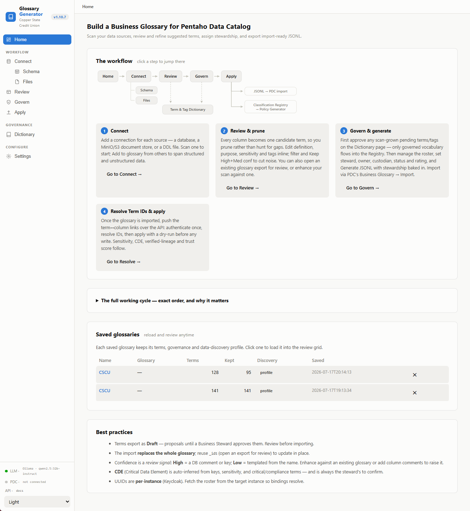
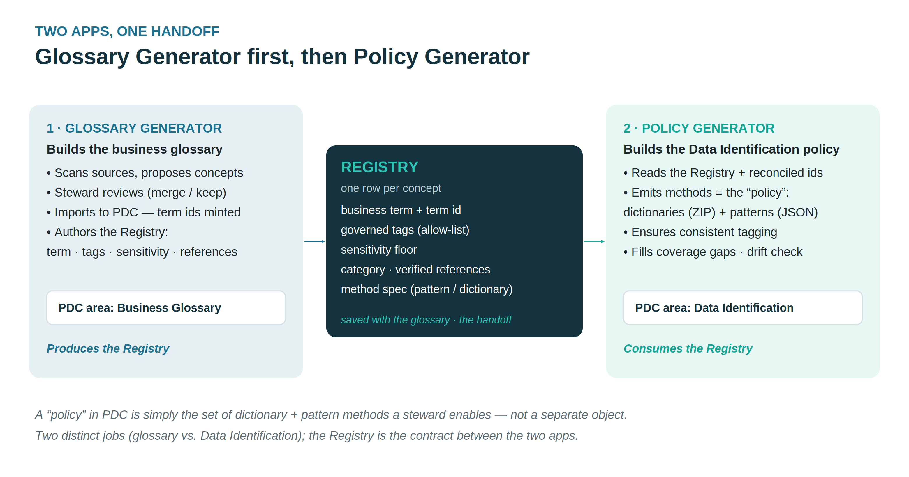
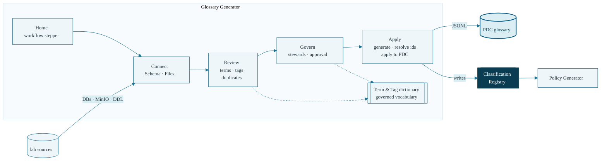

# Pentaho Data Catalog Glossary Generator

**Version:** 1.10.8 · validated against Pentaho Data Catalog 11.0.0 (public
API v3). FastAPI backend with interactive API docs at **`/docs`**, and a
**React 18 + Vite frontend** (`frontend/`, on the shared Policy Generator
design kit) served from `frontend/dist` when built — the legacy Jinja shell
remains as the fallback at `/` until then (the PDC-Demo installer builds the
UI; manual: `cd frontend && npm install && npm run build`). A committed
offline **pytest** suite keeps it honest (`pytest -q` from
`glossary_generator/`): the engine checks, the PDC v3 API shape checks, the
endpoint contract via TestClient, and a docs-consistency test that fails when
VERSION, the changelog and this README drift apart. The sidebar
**version pill** is clickable — it shows the running build's release notes
and flags a pulled-but-not-restarted mismatch.



A local-first web app that **scans your data sources, suggests a business
glossary, lets a steward review and govern it, and exports import-ready JSONL**
for **Pentaho Data Catalog → Business Glossary → Import** — so the glossary and
its tags stay governed instead of drifting.


The app is **scenario-generic**; each training scenario ships as a separate,
self-contained bundle — data kit, domain pack and courseware — served by one
shared lab stack:

All four verticals — **CSCU** (financial services), **RETAIL** (Canyon Trail
Outfitters), **HEALTH** (Lakeshore Health Partners) and **MFG** (Cascade
Precision Components) — live in the **[PDC-Scenarios](https://github.com/jporeilly/PDC-Scenarios)**
repo: one folder per vertical holding the data kit, the domain pack and the
courseware for the platform and both apps. Deploy one with its
`select-vertical.sh <ID>` (sparse pull), install it into this app with its
`install-scenario.sh <ID>`.

Each scenario carries Workshops 0–5 at full depth, its own cast across all
seven PDC roles, planted data defects the workshops expose, and a custom
identification-pattern family; CSCU additionally carries the Technical Track
and both app workshops. Additional scenarios plug into PDC-Scenarios as data
folders — a `data_sources/<ID>/` with a `scenario.json` beside a
`courseware/<ID>/` set — with no code changes anywhere.

## Why — the Registry

In PDC the same three facts about a column — its business term, its tags, and
its sensitivity — get decided in more than one place, by hand. Nothing forces
them to agree, so vocabularies drift (`PII` vs `pii`) and classifications become
hard to defend in an audit.

This app maintains **one governed answer per concept**: a controlled two-layer
**Term & Tag dictionary** (generic baseline + steward-approved company layer),
and a **Classification Registry** written at export time
(`registries/registry.<glossary>.json`).



The Registry is the **contract between two separate apps**, used in order —
mirroring PDC's own split between the Business Glossary and Data
Identification:

1. **Glossary Generator** (this repo) builds the business glossary: it scans
   sources, proposes concepts, lets the steward review them, and produces the
   JSONL you import into PDC (which mints the term ids). As a by-product of
   export it **authors the Registry** — one row per concept with the business
   term, governed tags (from a controlled allow-list), rule-based sensitivity,
   and category.
2. **[Policy Generator](https://github.com/jporeilly/PDC-Policy-Generator)** (a separate
   app, its own repo) **reads the Registry** — with the term ids reconciled after import — and emits PDC's
   Data Identification methods: dictionaries (ZIP) and patterns (JSON), each
   bound to its term and stamping the Registry's tags. It also drift-checks
   deployed methods against the Registry. Since 1.8.x the Registry rows carry
   ready-made **detection seeds** (the scan's induced value regexes and
   profiled reference lists) plus PK/FK relationship facts — and the Glossary
   Generator's **Draft policies (AI)** button already turns those seeds into
   importable pattern/dictionary files.

Because both apps draw from the same row, the glossary term, the tags a method
stamps, and the sensitivity can no longer quietly diverge. The full rationale
is in [GUIDE.md](docs/GUIDE.md) (Part A), and the other
workshop figures are in [diagrams/](glossary_generator/diagrams/).

## What it does

One pass through the app, page by page — the sidebar stepper walks the same
order:



- **Connect** — live database scan (PostgreSQL, SQL Server, MySQL/MariaDB,
  Oracle), MinIO/S3 document stores, or a plain DDL file. Or skip direct access
  entirely and **harvest from what PDC has already cataloged**. The schema
  browser (tables, PK/FK relationships, write-back of missing keys) and the
  MinIO/S3 object browser live on their own **Schema** and **Files**
  sub-pages under Connect. Schema renders as **Cards or an ER diagram**
  (toggle; ER by default when relationships exist) — table nodes with PK/FK
  rows, FK→PK edges, layered auto-layout, pan/zoom/drag — and its
  diagram-a-DDL panel is a **drag-and-drop zone** (.sql/.ddl/.txt, paste
  preserved). The sidebar footer's **PDC dot** lights as soon as any page
  really talks to PDC — Get token, a harvest read, or a bulk-load run.
- **Review** — one suggested term per business-meaningful column, with inferred
  sensitivity, PII category, CDE flag, governed lower-case tags, and an
  evidence-based confidence signal. The scan **learns value formats from the
  data** (position signatures → anchored regexes like `^CSCU-\d{6}$`) and
  keeps profiled reference lists as evidence on every row. Edit everything
  inline; duplicate groups come with an evidence-grounded **Merge /
  Disambiguate / Keep separate recommendation** (escalating to a live
  data-value probe and an AI adjudicator on demand). A **"How to review —
  the working order"** guide panel (open by default) walks the steward
  through Prune → Resolve duplicates → Enrich & QA → Name → Govern; the
  grid scrolls in its own pane with a sticky header and frozen Keep /
  Category / Term columns, and **Definition and Purpose expand in place**
  to a full-width editor row with the scan evidence right underneath.
- **Govern** — steward/owner/custodian assignment driven by the
  Keycloak-fetched roster: candidate pools are **constrained to each person's
  actual roster roles**, expertise beats defaults only on a strict win, and
  the business domain auto-derives from the company data. Plus ratings,
  review dates, and a steward approval gate over the vocabulary with a full
  audit trail.
- **Generate & apply** — export the kept terms as PDC-importable JSONL, then
  resolve term ids (fuzzy + **in-place AI matching** for renamed or
  outstanding terms — no round-trip through the PDC glossary UI) and **apply
  term links, tags, sensitivity and descriptions back onto PDC entities**
  over the public API v3: column links, table terms and sensitivity rollups,
  folder rating/DQ/sensitivity rollups, a Data Discovery completion watcher,
  and a Trust Score rollup to finish.
- **Steward-safe governance** — mistakes are recoverable in-product: every
  vocabulary decision is reversible per item (labelled **✓ Approve /
  ✕ Retire / ⤵ To alias** actions on approved terms and tags), a retire is
  **durable** (tombstoned through reseeds, offered for removal from the
  pack at export), *Approve all* confirms its consequences, bulk
  retire-empty is gated until the dictionary has grown from a scan, and an
  **AI fold advisor** proposes alias folds across the governed vocabulary
  (abbreviation-expansion twins → one-click or Fold-all). The Dictionary
  page explains itself: a flywheel panel plus an **"Approve, Retire or
  Alias"** explainer with worked examples, and **AI review of the pending
  vocabulary** sits right in the pending-panel header. Facet-preview
  counts are **honest** — distinct current terms per tag (rescans are
  no-ops), and the preview notes that live facets appear in PDC only after
  methods deploy and Data Identification runs. Everything lands in the
  append-only audit trail.
- **State that takes care of itself** — the app auto-resumes your last saved
  glossary on start and **autosaves** the workspace every 30 seconds (and on
  page close) once it exists; all state survives `git pull` untouched, and
  **Settings → State snapshot** zips everything for machine moves and
  restore points. The **full working cycle** — scan to committed pack — is
  documented as a panel on the Home page.
- **AI agents (optional, local)** — eleven guardrailed agents over a local
  **Ollama** model: definition/purpose enrichment, evidence-grounded term/tag/
  sensitivity suggestions, duplicate-group adjudication, definition QA (with a
  deterministic linter that also works offline), category assignment, roster
  expertise, business-domain suggestion, pending-vocabulary review (with
  alias folding), term-id matching at resolve time, the governed-vocabulary
  fold advisor, and **Draft policies (AI)** — detection seeds →
  ready-to-import PDC pattern/dictionary rule files. Every agent proposes; the steward applies. The grid agents sit
  in a labelled **"AI AGENTS — propose → you apply"** group and run on
  **kept rows only** — prune 141→95 and they process 95, with progress
  reading "0/95 (kept rows)". Fully offline-safe: no
  Ollama, no problem — heuristics remain.
- **The pack flywheel** — packs start hand-authored but don't stay that way:
  **Export domain pack** (Dictionary page) merges the reviewed scan state
  back into the installed pack — table mappings, learned abbreviations, the
  approved vocabulary, and `curated_seeds` carrying the induced value
  patterns and reference lists, detection seeds specific to *your* data.
  Additions fill gaps; where the scan **disagrees** with the pack, each
  conflict is listed for the steward to decide (curated seeds default to the
  fresher scan evidence; steward-retired entries default to removal). **Apply to this app** installs the refreshed pack
  and reseeds the dictionary (approved items survive); commit it to the
  scenario repo and every future install starts from evidence instead of
  guesses. No pack yet? Run packless, scan + review once — the first export
  *is* your base pack.

## Repository layout

```text
glossary_generator/     the app (scenario-generic)
  api.py                FastAPI backend (Swagger UI at /docs); serves
                        frontend/dist at "/" when built, else the legacy shell
  static/, templates/   the legacy UI (Jinja shell + numbered plain scripts) —
                        the fallback until the React build exists
  pdc_api.py            shim → the shared pdc_client package (repo root)
  llm.py, llm_detect.py local Ollama client + host/GPU detection
  tests/                offline pytest suite — engine, endpoint, PDC v3 shape
                        and docs-consistency checks; run after every pull
frontend/               React 18 + Vite UI (shared Policy design kit) —
                        npm run build → frontend/dist, served by api.py;
                        the PDC-Demo installer builds it in deployments
pdc_client/             shared PDC Public API client package (core, entities,
                        terms, jobs, apply, bulkload) — stdlib-only, reusable
                        by sibling apps (Policy Generator next)
docs/                   all documentation (reference, guide, changelog, …)
pdc-reset.sh            wipe + rebuild the PDC deployment on the VM, incl. the
                        OpenSearch security-index auto-repair (see docs/PDC-VM-TROUBLESHOOTING.md)

(scenario data, domain packs, courseware, the shared lab and the
install/reset-scenario scripts moved to the PDC-Scenarios repo)
```

## Install & run

**Requirements:** Python 3.9+ on Windows 11 or macOS (the usual hosts), or
the Ubuntu 24.04 training VM. Everything runs locally; PDC and Ollama are
reached over the network only when you use those features.

### Windows 11 host (one command)

The standard topology runs the apps on the **Windows host** (Ollama lives
there) and the lab + PDC on the Ubuntu VM. **One bootstrap** (PDC-Scenarios
repo) stands up / refreshes the whole `C:\PDC-Demo` checkout — this app, the
**Policy Generator**, **Catalog Insights**, and the selected vertical's
assets (sparse-pulled) — and installs the vertical's pack into this app:

```powershell
iex "& { $(irm https://raw.githubusercontent.com/jporeilly/PDC-Scenarios/main/install-pdc-demo.ps1) } CSCU"
```

Re-run it bare to update everything (it remembers the vertical). After any
update: restart the app, click the **version pill** (it flags a stale
build), and run `pytest -q` from `glossary_generator/`.

### Lab VM (one command)

On the Ubuntu lab VM, the bash twin does the same into `~/PDC-Demo`, and one
make entry loads the vertical's data sources:

```bash
curl -fsSL https://raw.githubusercontent.com/jporeilly/PDC-Scenarios/main/install-pdc-demo.sh | bash -s -- CSCU
cd ~/PDC-Demo/PDC-Scenarios && make scenario ID=CSCU   # lab up + data loaded
```

This repo's own `install-pdc-demo.sh` updates just this checkout + the vertical.

### 1. Pick a scenario (PDC-Scenarios repo)

```bash
git clone --filter=blob:none https://github.com/jporeilly/PDC-Scenarios.git
cd PDC-Scenarios
./select-vertical.sh CSCU        # sparse-pull just this vertical
./install-scenario.sh CSCU       # installs the pack + roster into this app
# Windows: .\install-scenario.ps1
```

This copies the selected scenario's vocabulary (`domain_pack.json`), steward
roster (`people.json`), company name (`.env`) and PDC bulk-load connections
(`datasources.csv`) into the app's runtime config
— all git-ignored, so the app itself stays clean. One scenario at a time.
If you pin `GLOSSARY_DOMAIN_PACK` / `GLOSSARY_PEOPLE_SEED` in `.env` (they
override the copied files), the installer retargets them to the selected
scenario.
(Equivalent manual step: unzip PDC-Scenarios' `data_sources/<scenario>/*-domain-pack.zip`
into `glossary_generator/`.) To switch scenarios, just rerun it; to remove the
scenario and reset the app to generic, run `./reset-scenario.sh`
(`-All` / `--all` also clears connections, settings and saved glossaries).

### 2. Stand up the lab sources

One shared PostgreSQL + MinIO hosts every scenario (one database + one bucket
each), so scenarios coexist without port conflicts:

```bash
cd PDC-Scenarios/data_sources/lab   # on the Docker host (the Ubuntu VM)
cp .env.example .env
make up                          # shared postgres + minio
make load SCENARIO=CSCU          # and/or RETAIL, HEALTH, MFG
```

The **end-to-end guide** — repository, one-time network setup, lab, app,
PDC connections, and rebuild troubleshooting (Parts A–I) — is
PDC-Scenarios' `data_sources/lab/lab-setup.docx`.

### 3. Run the app

```bash
cd glossary_generator
./run.sh                         # Linux/macOS → http://127.0.0.1:5000
.\run.ps1                        # Windows (or run.bat)
```

Then open **[http://127.0.0.1:5000](http://127.0.0.1:5000)** and follow the workflow stepper:
*Connect → Review → Govern → Apply*. The scenario's workshop guide is in
PDC-Scenarios' `courseware/<scenario>/`.

### Optional: LLM enrichment

```bash
ollama pull llama3.2:3b      # or use the app's Pull model button
ollama serve                 # http://localhost:11434
```

The app detects Ollama automatically (on Windows set
`OLLAMA_URL=http://127.0.0.1:11434` — see [REFERENCE.md](docs/REFERENCE.md)
for why). Configuration beyond that: copy
[`.env.example`](glossary_generator/.env.example) to `.env` — every setting is
optional.

## Documentation

| Document                                                   | What it covers                                                                                                |
| ---------------------------------------------------------- | ------------------------------------------------------------------------------------------------------------- |
| [REFERENCE.md](docs/REFERENCE.md)                           | App reference: env vars, drivers, Ollama/GPU, API, repository manifest                                        |
| [GUIDE.md](docs/GUIDE.md)                                   | THE manual: why (Registry) + install/setup + walkthrough + real-PDC operating notes                           |
| [CHANGELOG.md](docs/CHANGELOG.md)                           | Release history                                                                                               |
| [PDC-VM-TROUBLESHOOTING.md](docs/PDC-VM-TROUBLESHOOTING.md) | PDC platform errors on the lab VM (OpenSearch init, site-wide 404, certs, licensing)                          |
| [PDC-Scenarios](https://github.com/jporeilly/PDC-Scenarios) | Every vertical's data kit, domain pack and courseware — incl. the shared lab and lab-setup.docx (Parts A–I) |

*All scenario data — Copper State Credit Union, Canyon Trail Outfitters,
Lakeshore Health Partners and Cascade Precision Components — is fictional and
generated for training.*
