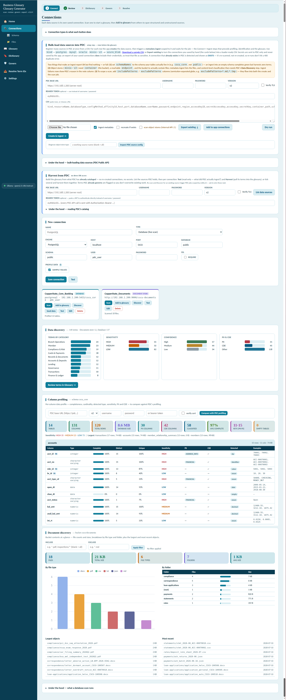
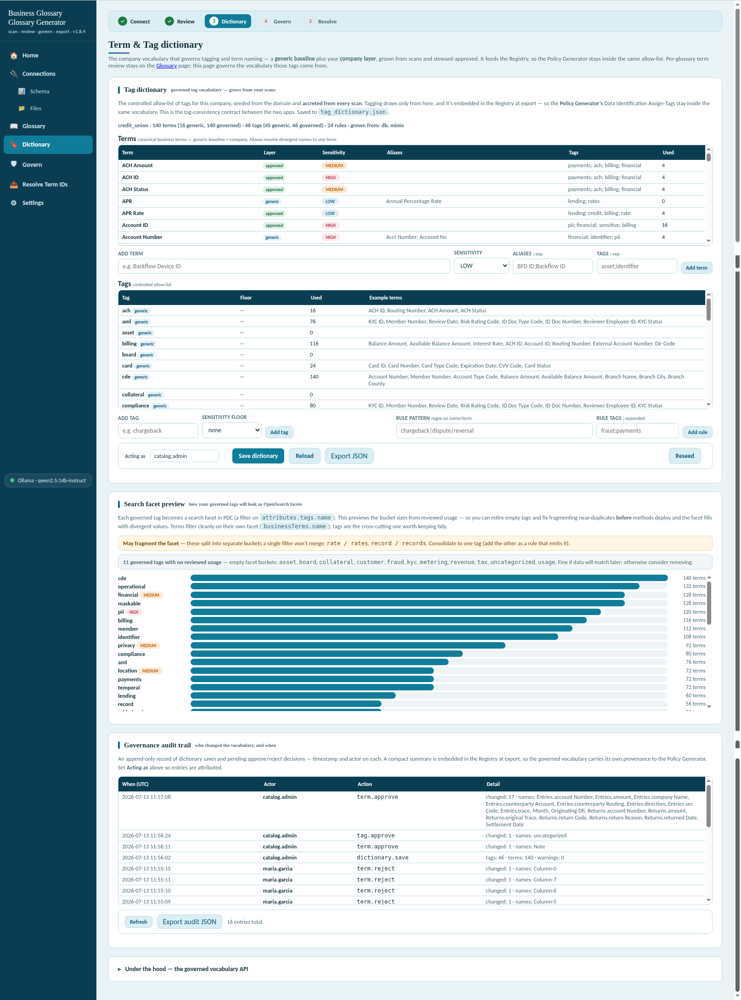
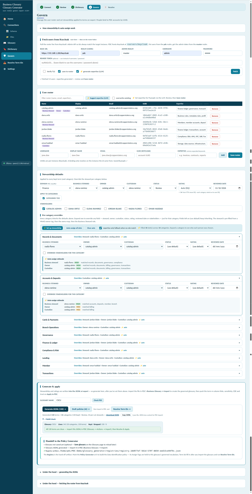

# PDC Glossary Generator

**Version:** 1.8.4 · validated against Pentaho Data Catalog 11.0.0

A local-first web app that **scans your data sources, suggests a business
glossary, lets a steward review and govern it, and exports import-ready JSONL**
for **Pentaho Data Catalog → Business Glossary → Import** — so the glossary and
its tags stay governed instead of drifting.

The app is **scenario-generic**; each training scenario ships as a separate,
self-contained bundle — data kit, domain pack and courseware — served by one
shared lab stack:

| Scenario                                      | Industry           | Data kit                                    | Courseware                              |
| --------------------------------------------- | ------------------ | ------------------------------------------- | --------------------------------------- |
| **CSCU** — Copper State Credit Union   | Financial services | [data_sources/CSCU/](data_sources/CSCU/)     | [courseware/CSCU/](courseware/CSCU/)     |
| **RETAIL** — Canyon Trail Outfitters   | Retail             | [data_sources/RETAIL/](data_sources/RETAIL/) | [courseware/RETAIL/](courseware/RETAIL/) |
| **HEALTH** — Lakeshore Health Partners | Healthcare         | [data_sources/HEALTH/](data_sources/HEALTH/) | [courseware/HEALTH/](courseware/HEALTH/) |
| **MFG** — Cascade Precision Components | Manufacturing      | [data_sources/MFG/](data_sources/MFG/)       | [courseware/MFG/](courseware/MFG/)       |

Each scenario carries Workshops 0–5 at full depth, its own cast across all
seven PDC roles, planted data defects the workshops expose, and a custom
identification-pattern family; CSCU additionally carries the Technical Track
and the app workshop. The consolidated user roster for all four is
[courseware/PDC-Users-All-Scenarios.md](courseware/PDC-Users-All-Scenarios.md).

Additional scenarios plug in as data folders — drop a `data_sources/<ID>/`
with a `scenario.json` and it becomes loadable and installable with no code
changes.

## Why — the Registry

In PDC the same three facts about a column — its business term, its tags, and
its sensitivity — get decided in more than one place, by hand. Nothing forces
them to agree, so vocabularies drift (`PII` vs `pii`) and classifications become
hard to defend in an audit.

This app maintains **one governed answer per concept**: a controlled two-layer
**Term & Tag dictionary** (generic baseline + steward-approved company layer),
and a **Classification Registry** written at export time
(`registries/registry.<glossary>.json`).


The Registry is the **contract between two separate apps**, used in order —
mirroring PDC's own split between the Business Glossary and Data
Identification:

1. **Glossary Generator** (this repo) builds the business glossary: it scans
   sources, proposes concepts, lets the steward review them, and produces the
   JSONL you import into PDC (which mints the term ids). As a by-product of
   export it **authors the Registry** — one row per concept with the business
   term, governed tags (from a controlled allow-list), rule-based sensitivity,
   and category.
2. **Policy Generator** (a separate app, shipped independently) **reads the
   Registry** — with the term ids reconciled after import — and emits PDC's
   Data Identification methods: dictionaries (ZIP) and patterns (JSON), each
   bound to its term and stamping the Registry's tags. It also drift-checks
   deployed methods against the Registry. Since 1.8.x the Registry rows carry
   ready-made **detection seeds** (the scan's induced value regexes and
   profiled reference lists) plus PK/FK relationship facts — and the Glossary
   Generator's **Draft policies (AI)** button already turns those seeds into
   importable pattern/dictionary files, covering the Policy Generator's
   authoring half today.

Because both apps draw from the same row, the glossary term, the tags a method
stamps, and the sensitivity can no longer quietly diverge. The full rationale
is in [CHALLENGE-AND-GOAL.md](docs/CHALLENGE-AND-GOAL.md), and the other
workshop figures are in [diagrams/](glossary_generator/diagrams/).

## What it does

- **Connect** — live database scan (PostgreSQL, SQL Server, MySQL/MariaDB,
  Oracle), MinIO/S3 document stores, or a plain DDL file. Or skip direct access
  entirely and **harvest from what PDC has already cataloged**.

    

- **Review** — one suggested term per business-meaningful column, with inferred
  sensitivity, PII category, CDE flag, governed lower-case tags, and an
  evidence-based confidence signal. The scan **learns value formats from the
  data** (position signatures → anchored regexes like `^CSCU-\d{6}$`) and
  keeps profiled reference lists as evidence on every row. Edit everything
  inline; duplicate groups come with an evidence-grounded **Merge /
  Disambiguate / Keep separate recommendation** (escalating to a live
  data-value probe and an AI adjudicator on demand).

    

- **Govern** — steward/owner/custodian assignment (manual or keyword
  auto-assign from a Keycloak-fetched roster), ratings, review dates, and a
  steward approval gate over the vocabulary, with a full audit trail.

    

- **Generate & apply** — export the kept terms as PDC-importable JSONL, then
  resolve term ids and **apply term links, tags and sensitivity back onto PDC
  column entities** over the public API, ending with a Trust Score rollup.
- **AI agents (optional, local)** — seven guardrailed agents over a local
  **Ollama** model: definition/purpose enrichment, evidence-grounded term/tag/
  sensitivity suggestions, duplicate-group adjudication, definition QA (with a
  deterministic linter that also works offline), category assignment, roster
  expertise, and **Draft policies (AI)** — detection seeds → ready-to-import
  PDC pattern/dictionary rule files. Every agent proposes; the steward
  applies. Fully offline-safe: no Ollama, no problem — heuristics remain.

## Repository layout

```text
glossary_generator/     the app (scenario-generic): Flask API + review UI
docs/                   all documentation (reference, guide, install, changelog, …)
data_sources/           scenario data + the shared lab
  lab/                  ONE PostgreSQL + ONE MinIO for all scenarios; make load
                        SCENARIO=<ID> creates that scenario's db + bucket
  CSCU/                 the financial-services scenario: sample DB SQL, MinIO
                        documents, domain pack + install zip, bulk-load CSV
  RETAIL/               the retail scenario (Canyon Trail Outfitters), same kit
  HEALTH/               the healthcare scenario (Lakeshore Health Partners), same kit
  MFG/                  the manufacturing scenario (Cascade Precision Components), same kit
courseware/             one workshop set per scenario (CSCU/, RETAIL/, HEALTH/, MFG/)
install-scenario.sh     scenario picker/installer (install-scenario.ps1 on Windows)
reset-scenario.sh       remove the installed scenario / reset the app to generic
pdc-reset.sh            wipe + rebuild the PDC deployment on the VM, incl. the
                        OpenSearch security-index auto-repair (see docs/PDC-VM-TROUBLESHOOTING.md)
```

## Install & run

**Requirements:** Python 3.9+ (or Docker). Everything runs locally; PDC and
Ollama are reached over the network only when you use those features.

### 1. Pick a scenario

```bash
./install-scenario.sh            # lists the scenarios, installs the pack + roster
# Windows: .\install-scenario.ps1
```

This copies the selected scenario's vocabulary (`domain_pack.json`), steward
roster (`people.json`), company name (`.env`) and PDC bulk-load connections
(`datasources.csv`) into the app's runtime config
— all git-ignored, so the app itself stays clean. One scenario at a time.
If you pin `GLOSSARY_DOMAIN_PACK` / `GLOSSARY_PEOPLE_SEED` in `.env` (they
override the copied files), the installer retargets them to the selected
scenario.
(Equivalent manual step: unzip `data_sources/<scenario>/*-domain-pack.zip`
into `glossary_generator/`.) To switch scenarios, just rerun it; to remove the
scenario and reset the app to generic, run `./reset-scenario.sh`
(`-All` / `--all` also clears connections, settings and saved glossaries).

### 2. Stand up the lab sources

One shared PostgreSQL + MinIO hosts every scenario (one database + one bucket
each), so scenarios coexist without port conflicts:

```bash
cd data_sources/lab              # on the Docker host (the Ubuntu VM)
cp .env.example .env
make up                          # shared postgres + minio
make load SCENARIO=CSCU          # and/or RETAIL, HEALTH, MFG
```

The **end-to-end guide** — repository, one-time network setup, lab, app,
PDC connections, and rebuild troubleshooting (Parts A–I) — is
[data_sources/lab/lab-setup.docx](data_sources/lab/lab-setup.docx).

### 3. Run the app

```bash
cd glossary_generator
./run.sh                         # Linux/macOS → http://127.0.0.1:5000
.\run.ps1                        # Windows (or run.bat)
docker compose up --build        # Docker
```

Then open **[http://127.0.0.1:5000](http://127.0.0.1:5000)** and follow the workflow stepper:
*Connect → Review → Govern → Apply*. The scenario's workshop guide is in
`courseware/<scenario>/`.

### Optional: LLM enrichment

```bash
ollama pull llama3.2:3b      # or use the app's Pull model button
ollama serve                 # http://localhost:11434
```

The app detects Ollama automatically (on Windows set
`OLLAMA_URL=http://127.0.0.1:11434` — see [REFERENCE.md](docs/REFERENCE.md)
for why). Configuration beyond that: copy
[`.env.example`](glossary_generator/.env.example) to `.env` — every setting is
optional.

## Documentation

| Document                                                   | What it covers                                                                       |
| ---------------------------------------------------------- | ------------------------------------------------------------------------------------ |
| [REFERENCE.md](docs/REFERENCE.md)                           | App details: env vars, drivers, Ollama/GPU, API reference                            |
| [GUIDE.md](docs/GUIDE.md)                                   | Full walkthrough of every page and workflow                                          |
| [INSTALL.md](docs/INSTALL.md)                               | Setup against your own PDC instance (Docker + local)                                 |
| [CHALLENGE-AND-GOAL.md](docs/CHALLENGE-AND-GOAL.md)         | The Registry thesis, plain language                                                  |
| [SUPPLEMENT.md](docs/SUPPLEMENT.md)                         | Operating notes for a real PDC instance                                              |
| [MANIFEST.md](docs/MANIFEST.md)                             | Full repository layout and packaging                                                 |
| [CHANGELOG.md](docs/CHANGELOG.md)                           | Release history                                                                      |
| [PDC-VM-TROUBLESHOOTING.md](docs/PDC-VM-TROUBLESHOOTING.md) | PDC platform errors on the lab VM (OpenSearch init, site-wide 404, certs, licensing) |
| [lab-setup.docx](data_sources/lab/lab-setup.docx)           | The consolidated lab install & configuration guide (Parts A–I)                      |
| [data_sources/](data_sources/)                              | The shared lab + one data kit per scenario                                           |
| [courseware/](courseware/)                                  | One workshop set per scenario + the consolidated PDC user roster                     |

*All scenario data — Copper State Credit Union, Canyon Trail Outfitters,
Lakeshore Health Partners and Cascade Precision Components — is fictional and
generated for training.*
