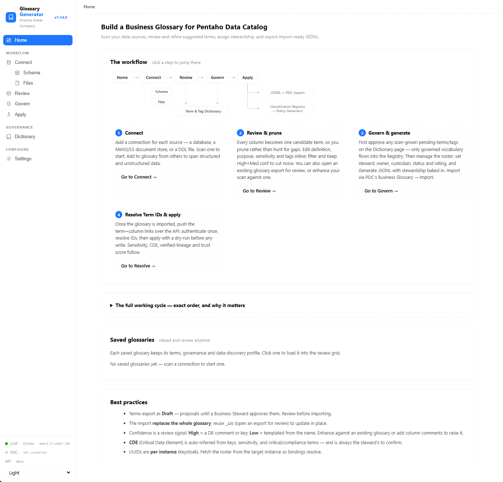
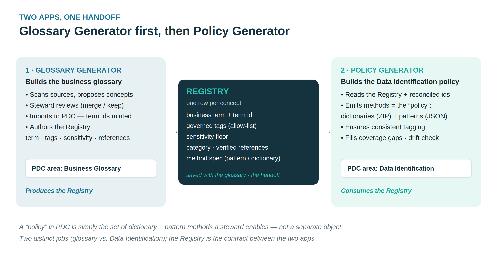
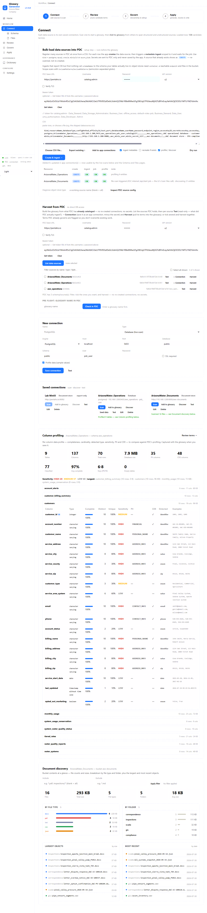
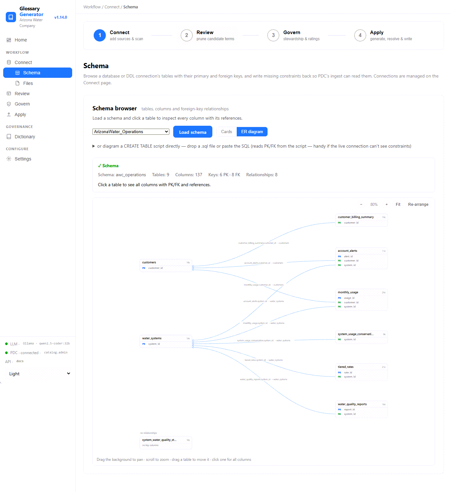

<h1 align="center">Pentaho Data Catalog Glossary Generator</h1>

<p align="center">
  <b>Scan your data sources → suggest a business glossary → govern it → export import-ready JSONL.</b><br>
  A local-first web app for <b>Pentaho Data Catalog → Business Glossary → Import</b> —<br>
  so the glossary and its tags stay governed instead of drifting.
</p>

<p align="center">
  
  
  
  
  
  
</p>

<p align="center">
  <a href="#overview"><b>Overview</b></a> ·
  <a href="#why--the-registry"><b>Why — the Registry</b></a> ·
  <a href="#walkthrough"><b>Walkthrough</b></a> ·
  <a href="#beyond-the-walkthrough"><b>Beyond the walkthrough</b></a> ·
  <a href="#install--run"><b>Install &amp; run</b></a> ·
  <a href="#repository-layout"><b>Repository layout</b></a> ·
  <a href="#documentation"><b>Documentation</b></a>
</p>

---

**Version:** 1.37.7 · validated against Pentaho Data Catalog 11.0.0 (public API v3).

> [!TIP]
> **Quick start (Windows 11 host):** one command stands up the whole
> `C:\PDC-Demo` checkout — this app, the Policy Generator, Catalog Insights
> and a training vertical.
>
> ```powershell
> iex "& { $(irm https://raw.githubusercontent.com/jporeilly/PDC-Scenarios/main/install-pdc-demo.ps1) } CSCU"
> ```
>
> Full options — lab VM, step by step, LLM — under [Install &amp; run](#install--run).

<details>
<summary><b>What's in this build</b> — backend, frontend and the drift guards</summary>

<br>

FastAPI backend with interactive API docs at **`/docs`**, and a
**React 18 + Vite frontend** (`frontend/`, on the shared Policy Generator
design kit) served from `frontend/dist`. There is no fallback UI — the Jinja
shell went at 1.35.0, so until the build exists `/` answers **503** with the
command to fix it (the PDC-Demo installer builds it; manual:
`cd frontend && npm ci && npm run build`). A committed
offline **pytest** suite keeps it honest (`pytest -q` from
`glossary_generator/`): the engine checks, the PDC v3 API shape checks, the
endpoint contract via TestClient, and a docs-consistency test that fails when
VERSION, the changelog and this README drift apart. The sidebar
**version pill** is clickable — it shows the running build's release notes
and flags a pulled-but-not-restarted mismatch.

</details>

---

## Overview

<p align="center">
  
</p>

The app maintains **one governed answer per concept** and hands it to PDC in
four moves:

| Step | Page | What you get |
| --- | --- | --- |
| ① | **[Connect](#walkthrough)** | Register the estate in PDC (bulk load), then **harvest** what PDC has cataloged — structure, governance and the value evidence it profiled. No source credentials needed |
| ② | **[Review](#walkthrough)** | One candidate term per meaningful column, with evidence, AI proposals and duplicate resolution |
| ③ | **[Govern](#walkthrough)** | Stewardship from the real roster, ratings, and the approval gate |
| ④ | **[Generate &amp; apply](#walkthrough)** | Import-ready JSONL, the Classification Registry, and a write-back onto PDC entities |

<details>
<summary><b>Scenarios</b> — the app is generic; each vertical ships as its own bundle</summary>

<br>

The app is **scenario-generic**; each training scenario ships as a separate,
self-contained bundle — data kit, domain pack and courseware — served by one
shared lab stack:

All four verticals — **CSCU** (financial services), **RETAIL** (Canyon Trail
Outfitters), **HEALTH** (Lakeshore Health Partners) and **MFG** (Cascade
Precision Components) — live in the **[PDC-Scenarios](https://github.com/jporeilly/PDC-Scenarios)**
repo: one folder per vertical holding the data kit, the domain pack and the
courseware for the platform and both apps. Deploy one with its
`select-vertical.sh <ID>` (sparse pull), install it into this app with its
`install-scenario.sh <ID>`.

Each scenario carries Workshops 0–5 at full depth, its own cast across all
seven PDC roles, planted data defects the workshops expose, and a custom
identification-pattern family; CSCU additionally carries the Technical Track
and both app workshops. Additional scenarios plug into PDC-Scenarios as data
folders — a `data_sources/<ID>/` with a `scenario.json` beside a
`courseware/<ID>/` set — with no code changes anywhere.

</details>

---

## Why — the Registry

In PDC the same three facts about a column — its business term, its tags, and
its sensitivity — get decided in more than one place, by hand. Nothing forces
them to agree, so vocabularies drift (`PII` vs `pii`) and classifications become
hard to defend in an audit.

This app maintains **one governed answer per concept**: a controlled two-layer
**Term & Tag dictionary** (generic baseline + steward-approved company layer),
and a **Classification Registry** written at export time
(`registries/registry.<glossary>.json`).

<p align="center">
  
</p>

The Registry is the **contract between two separate apps**, used in order —
mirroring PDC's own split between the Business Glossary and Data
Identification:

1. **Glossary Generator** (this repo) builds the business glossary: it scans
   sources, proposes concepts, lets the steward review them, and produces the
   JSONL you import into PDC (which mints the term ids). As a by-product of
   export it **authors the Registry** — one row per concept with the business
   term, governed tags (from a controlled allow-list), rule-based sensitivity,
   and category.
2. **[Policy Generator](https://github.com/jporeilly/PDC-Policy-Generator)** (a separate
   app, its own repo) **reads the Registry** — with the term ids reconciled after import — and emits PDC's
   Data Identification methods: dictionaries (ZIP) and patterns (JSON), each
   bound to its term and stamping the Registry's tags. It also drift-checks
   deployed methods against the Registry. Since 1.8.x the Registry rows carry
   ready-made **detection seeds** (the scan's induced value regexes and
   profiled reference lists) plus PK/FK relationship facts — and the Glossary
   Generator's **Draft policies (AI)** button already turns those seeds into
   importable pattern/dictionary files.

> [!NOTE]
> Because both apps draw from the same row, the glossary term, the tags a
> method stamps, and the sensitivity can no longer quietly diverge.

The full rationale is in [GUIDE.md](docs/GUIDE.md) (Part A), and the other
workshop figures are in [diagrams/](glossary_generator/diagrams/).

---

## Walkthrough

One pass through the app, page by page — the sidebar stepper walks the same
order. Expand a step for what it does and how it looks.

<details>
<summary><b>① Connect</b> — register the estate in PDC, then harvest what it cataloged</summary>

<br>
**Bulk load** registers many sources in PDC at once from a CSV, ingests each
one's metadata, and can run the analysis pass straight after —
**Data Profiling** over a database's tables, **Data Discovery** over an
object store's files — so the setup is one stop with no step forgotten.
<p align="center">
  <br>
  <em>Connect — bulk-load into PDC, harvest what it cataloged, and probe what it exposes</em>
</p>
**PDC is the system of record.** Harvest reads back what the catalog holds
for a source — tables and columns, keys, comments, the governance PDC
already carries (sensitivity, trust, linked terms) *and* the value evidence
its profiling computed (reference lists, induced patterns, completeness and
uniqueness). That evidence is what mints Dictionaries, Data Patterns and DQ
expectations, so the whole downstream flow works from the catalog with **one
credential and no direct database access**. A built-in diagnostic reports
exactly what your PDC exposes, per column, with the raw payload.

Direct scanning (PostgreSQL, SQL Server, MySQL/MariaDB, Oracle, MinIO/S3, or
a plain DDL file) remains available behind an advanced disclosure for
sources PDC has not profiled. The schema
browser (tables, PK/FK relationships, write-back of missing keys) and the
MinIO/S3 object browser live on their own **Schema** and **Files**
sub-pages under Connect. Schema renders as **Cards or an ER diagram**
(toggle; ER by default when relationships exist) — table nodes with PK/FK
rows, FK→PK edges, layered auto-layout, pan/zoom/drag, and a **Fit that
really centres** (the canvas sizes itself to the diagram, dense layers
spread wider, and zoom is floored at 55% — a layer that would sink below
that wraps into side-by-side node-columns) — and its
diagram-a-DDL panel is a **drag-and-drop zone** (.sql/.ddl/.txt, paste
preserved). 
<p align="center">
  <br>
  <em>Schema — the ER diagram with PK/FK edges</em>
</p>
The sidebar footer's **PDC dot** lights as soon as any page
really talks to PDC — Get token, a harvest read, or a bulk-load run.
</details>

<details>
<summary><b>② Review</b> — one term per column: prune, enrich, resolve duplicates</summary>

<br>

One suggested term per business-meaningful column, with inferred
sensitivity, PII category, CDE flag, governed lower-case tags, and an
evidence-based confidence signal. The scan **learns value formats from the
data** (position signatures → anchored regexes like `^CSCU-\d{6}$`) and
keeps profiled reference lists as evidence on every row. Edit everything
inline; duplicate groups come with an evidence-grounded **Merge /
Disambiguate / Keep separate recommendation** (escalating to a live
data-value probe and an AI adjudicator on demand).

A **"How to review — the working order"** guide panel (open by default) is an
interactive, clickable flow: ① Prune → ② Name the glossary (autosave on — it
syncs the Dictionary) → ③ the AI pass (one call per batch of kept rows;
**AI review** on a row for a single-row re-run) → ④ Resolve duplicates on the
final names → ⑤ Approve the pending vocabulary (the box hops to the
Dictionary) → Govern (navigates). The grid scrolls in its own pane with a
sticky header and frozen Keep / Category / Term columns, and **Definition and
Purpose expand in place** to a full-width editor row with the scan evidence
right underneath.

<!-- screenshot slots — drop the files in docs/images/ and uncomment
<p align="center">
  <br>
  <em>The working order, as an interactive flow</em>
</p>
<p align="center">
  <br>
  <em>Agents propose; the steward accepts — inline, per cell</em>
</p>
<p align="center">
  <br>
  <em>Merge · Disambiguate · Keep separate, with the evidence behind the advice</em>
</p>
-->

</details>

<details>
<summary><b>③ Govern</b> — stewardship, ratings and the approval gate</summary>

<br>

Steward/owner/custodian assignment driven by the
Keycloak-fetched roster: candidate pools are **constrained to each person's
actual roster roles**, expertise beats defaults only on a strict win, and
the business domain auto-derives from the company data. Plus ratings,
review dates, and a steward approval gate over the vocabulary with a full
audit trail.

<!-- screenshot slot — drop the file in docs/images/ and uncomment
<p align="center">
  <br>
  <em>Govern — candidates constrained to each person's real PDC roles</em>
</p>
-->

</details>

<details>
<summary><b>④ Generate &amp; apply</b> — export JSONL, resolve ids, write back to PDC</summary>

<br>

Export the kept terms as PDC-importable JSONL, then
resolve term ids (fuzzy + **in-place AI matching** for renamed or
outstanding terms — no round-trip through the PDC glossary UI) and **apply
term links, tags, sensitivity and descriptions back onto PDC entities**
over the public API v3: column links, table terms and sensitivity rollups,
folder rating/DQ/sensitivity rollups, a **terminal-aware Data Discovery
watcher** (it stops the moment the discovery worker finishes and prints a
per-file wrap-up — profiled ✓ / no-DQ-from-PDC / failed — instead of
hanging until its 10-minute budget), and a Trust Score rollup to finish.

DQ is honest: an **unprofiled column carries no quality score** — the
exports omit `qualityScore` and the apply tables show a muted **DQ —**
chip instead of a fabricated 100. The Generate card's JSONL and the
drafted-policies zip can also go straight to the lab with **⇪ Send to
lab (MinIO)** — an upload to bucket `pdc-exports` over a saved
**write-capable** MinIO/S3 connection (`POST /api/lab-export`).

<!-- screenshot slots — drop the files in docs/images/ and uncomment
<p align="center">
  <br>
  <em>Generate — the JSONL and the Classification Registry in one pass</em>
</p>
<p align="center">
  <br>
  <em>Resolve and apply — term links, tags and sensitivity back onto PDC entities</em>
</p>
-->

</details>

---

## Beyond the walkthrough

<details>
<summary><b>Steward-safe governance</b> — every vocabulary decision is reversible</summary>

<br>

Mistakes are recoverable in-product: every
vocabulary decision is reversible per item (labelled **✓ Approve /
✕ Retire / ⤵ To alias** actions on approved terms and tags), a retire is
**durable** (tombstoned through reseeds, offered for removal from the
pack at export), *Approve all* confirms its consequences, bulk
retire-empty is gated until the dictionary has grown from a scan, and an
**AI fold advisor** proposes alias folds across the governed vocabulary
(abbreviation-expansion twins → one-click or Fold-all).

The Dictionary page explains itself: a flywheel panel plus an
**"Approve, Retire or Alias"** explainer with worked examples, and
**AI review of the pending vocabulary** sits right in the pending-panel
header. Facet-preview counts are **honest** — distinct current terms per tag
(rescans are no-ops), and the preview notes that live facets appear in PDC
only after methods deploy and Data Identification runs. Everything lands in
the append-only audit trail.

<!-- screenshot slots — drop the files in docs/images/ and uncomment
<p align="center">
  <br>
  <em>Pending steward review — enriched by your Review pass before you judge it</em>
</p>
<p align="center">
  <br>
  <em>The governed vocabulary: terms first, then the tag allow-list</em>
</p>
-->

</details>

<details>
<summary><b>State that takes care of itself</b> — autosave, resume and snapshots</summary>

<br>

The app auto-resumes your last saved
glossary on start and **autosaves** the workspace every 30 seconds (and on
page close) once it exists; all state survives `git pull` untouched, and
**Settings → State snapshot** zips everything for machine moves and
restore points. The **full working cycle** — scan to committed pack — is
documented as a panel on the Home page.

<!-- screenshot slot — drop the file in docs/images/ and uncomment
<p align="center">
  
</p>
-->

</details>

<details>
<summary><b>AI agents (optional, local)</b> — one combined pass, plus specialists, over Ollama</summary>

<br>

Guardrailed agents over a local **Ollama** model, led by
**AI pass (all fields)** — ONE model call per **batch of rows**, covering
definition, purpose, a clearer name, governed tags and a blank category. It
replaced four separate passes (Enrich, AI suggest, AI categorize, QA) that
swept every row on their own and overlapped on those fields, so the last one
silently overwrote the others. Measured on a real scan: 6 rows in a single
call where the old path spent ~36s *per row*. The deterministic work rides
along for free — governed tags re-derived from the Dictionary before the model
sees them, and the definition linter's QA flag. It is the **only** row-level
agent: **AI review**, on an expanded row, is the same call scoped to that row,
so there is no second prompt restating the guardrails. The rest: duplicate-group adjudication, definition QA (with a
deterministic linter that also works offline), category assignment, roster
expertise, business-domain suggestion, pending-vocabulary review (with
alias folding), term-id matching at resolve time, the governed-vocabulary
fold advisor, and **Draft policies (AI)** — detection seeds →
ready-to-import PDC pattern/dictionary rule files.

Every agent proposes; the steward accepts. Grid-agent
results land as **inline click-to-accept pills** right on the affected
cells, batch by batch while the run streams — nothing touches a row until
you accept its pill (or **Accept all** / **Dismiss all** from the strip
above the grid); there is no proposal popup. The agents sit in a labelled
**"AI AGENTS — kept rows · propose → you accept"** group and run on
**kept rows only** — prune 141→95 and they process 95, with progress
reading "0/95 (kept rows)".

> [!NOTE]
> Fully offline-safe: no Ollama, no problem — the heuristics remain.

<!-- screenshot slot — drop the file in docs/images/ and uncomment
<p align="center">
  
</p>
-->

</details>

<details>
<summary><b>The pack flywheel</b> — packs learn from every reviewed scan</summary>

<br>

Packs start hand-authored but don't stay that way:
**Export domain pack** (Dictionary page) merges the reviewed scan state
back into the installed pack — table mappings, learned abbreviations, the
approved vocabulary, and `curated_seeds` carrying the induced value
patterns and reference lists, detection seeds specific to *your* data.

Additions fill gaps; where the scan **disagrees** with the pack, each
conflict is listed for the steward to decide (curated seeds default to the
fresher scan evidence; steward-retired entries default to removal).
**Apply to this app** installs the refreshed pack
and reseeds the dictionary (approved items survive); commit it to the
scenario repo and every future install starts from evidence instead of
guesses. No pack yet? Run packless, scan + review once — the first export
*is* your base pack.

<!-- screenshot slot — drop the file in docs/images/ and uncomment
<p align="center">
  
</p>
-->

</details>

---

## Install &amp; run

> [!IMPORTANT]
> **Requirements:** Python 3.9+ on Windows 11 or macOS (the usual hosts), or
> the Ubuntu 24.04 training VM. Everything runs locally; PDC and Ollama are
> reached over the network only when you use those features.

<details>
<summary><b>Windows 11 host</b> — one command</summary>

<br>

The standard topology runs the apps on the **Windows host** (Ollama lives
there) and the lab + PDC on the Ubuntu VM. **One bootstrap** (PDC-Scenarios
repo) stands up / refreshes the whole `C:\PDC-Demo` checkout — this app, the
**Policy Generator**, **Catalog Insights**, and the selected vertical's
assets (sparse-pulled) — and installs the vertical's pack into this app:

```powershell
iex "& { $(irm https://raw.githubusercontent.com/jporeilly/PDC-Scenarios/main/install-pdc-demo.ps1) } CSCU"
```

Re-run it bare to update everything (it remembers the vertical). After any
update: restart the app, click the **version pill** (it flags a stale
build), and run `pytest -q` from `glossary_generator/`.

</details>

<details>
<summary><b>Lab VM</b> — one command</summary>

<br>

On the Ubuntu lab VM, the bash twin does the same into `~/PDC-Demo`, and one
make entry loads the vertical's data sources:

```bash
curl -fsSL https://raw.githubusercontent.com/jporeilly/PDC-Scenarios/main/install-pdc-demo.sh | bash -s -- CSCU
cd ~/PDC-Demo/PDC-Scenarios && make scenario ID=CSCU   # lab up + data loaded
```

This repo's own `install-pdc-demo.sh` updates just this checkout + the vertical.

</details>

<details>
<summary><b>Step by step</b> — pick a scenario, stand up the lab, run the app</summary>

<br>

### 1. Pick a scenario (PDC-Scenarios repo)

```bash
git clone --filter=blob:none https://github.com/jporeilly/PDC-Scenarios.git
cd PDC-Scenarios
./select-vertical.sh CSCU        # sparse-pull just this vertical
./install-scenario.sh CSCU       # installs the pack + roster into this app
# Windows: .\install-scenario.ps1
```

This copies the selected scenario's vocabulary (`domain_pack.json`), steward
roster (`people.json`), company name (`.env`) and PDC bulk-load connections
(`datasources.csv`) into the app's runtime config
— all git-ignored, so the app itself stays clean. One scenario at a time.
If you pin `GLOSSARY_DOMAIN_PACK` / `GLOSSARY_PEOPLE_SEED` in `.env` (they
override the copied files), the installer retargets them to the selected
scenario.
(Equivalent manual step: unzip PDC-Scenarios' `data_sources/<scenario>/*-domain-pack.zip`
into `glossary_generator/`.) To switch scenarios, just rerun it; to remove the
scenario and reset the app to generic, run `./reset-scenario.sh`
(`-All` / `--all` also clears connections, settings and saved glossaries).

### 2. Stand up the lab sources

One shared PostgreSQL + MinIO hosts every scenario (one database + one bucket
each), so scenarios coexist without port conflicts:

```bash
cd PDC-Scenarios/data_sources/lab   # on the Docker host (the Ubuntu VM)
cp .env.example .env
make up                          # shared postgres + minio
make load SCENARIO=CSCU          # and/or RETAIL, HEALTH, MFG
```

The **end-to-end guide** — repository, one-time network setup, lab, app,
PDC connections, and rebuild troubleshooting (Parts A–I) — is
PDC-Scenarios' `data_sources/lab/lab-setup.docx`.

### 3. Run the app

```bash
cd glossary_generator
./run.sh                         # Linux/macOS → http://127.0.0.1:5000
.\run.ps1                        # Windows (or run.bat)
```

Then open **[http://127.0.0.1:5000](http://127.0.0.1:5000)** and follow the workflow stepper:
*Connect → Review → Govern → Apply*. The scenario's workshop guide is in
PDC-Scenarios' `courseware/<scenario>/`.

</details>

<details>
<summary><b>Optional: LLM enrichment</b> — a local Ollama model</summary>

<br>

```bash
ollama pull llama3.2:3b      # or use the app's Pull model button
ollama serve                 # http://localhost:11434
```

The app detects Ollama automatically (on Windows set
`OLLAMA_URL=http://127.0.0.1:11434` — see [REFERENCE.md](docs/REFERENCE.md)
for why). Configuration beyond that: copy
[`.env.example`](glossary_generator/.env.example) to `.env` — every setting is
optional.

</details>

---

## Repository layout

<details>
<summary><b>What lives where</b></summary>

<br>

```text
glossary_generator/     the app (scenario-generic)
  api.py                FastAPI backend (Swagger UI at /docs); serves
                        frontend/dist at "/" when built, else the legacy shell
  static/, templates/   the legacy UI (Jinja shell + numbered plain scripts) —
                        the fallback until the React build exists
  pdc_api.py            shim → the shared pdc_client package (repo root)
  llm.py, llm_detect.py local Ollama client + host/GPU detection
  tests/                offline pytest suite — engine, endpoint, PDC v3 shape
                        and docs-consistency checks; run after every pull
frontend/               React 18 + Vite UI (shared Policy design kit) —
                        npm run build → frontend/dist, served by api.py;
                        the PDC-Demo installer builds it in deployments
pdc_client/             shared PDC Public API client package (core, entities,
                        terms, jobs, apply, bulkload) — stdlib-only, reusable
                        by sibling apps (Policy Generator next)
docs/                   all documentation (reference, guide, changelog, …)
docs/images/            README screenshots (the walkthrough slots above)
pdc-reset.sh            wipe + rebuild the PDC deployment on the VM, incl. the
                        OpenSearch security-index auto-repair (see docs/PDC-VM-TROUBLESHOOTING.md)

(scenario data, domain packs, courseware, the shared lab and the
install/reset-scenario scripts moved to the PDC-Scenarios repo)
```

</details>

---

## Documentation

| Document | What it covers |
| --- | --- |
| [REFERENCE.md](docs/REFERENCE.md) | App reference: env vars, drivers, Ollama/GPU, API, repository manifest |
| [GUIDE.md](docs/GUIDE.md) | THE manual: why (Registry) + install/setup + walkthrough + real-PDC operating notes |
| [GLOSSARY-STRATEGY.html](docs/GLOSSARY-STRATEGY.html) | Implementing a glossary in PDC: rollout phases, the conditions under which glossaries drift, sizing the domain split, and the gotchas that look like success |
| [CHANGELOG.md](docs/CHANGELOG.md) | Release history |
| [PDC-VM-TROUBLESHOOTING.md](docs/PDC-VM-TROUBLESHOOTING.md) | PDC platform errors on the lab VM (OpenSearch init, site-wide 404, certs, licensing) |
| [PDC-Scenarios](https://github.com/jporeilly/PDC-Scenarios) | Every vertical's data kit, domain pack and courseware — incl. the shared lab and lab-setup.docx (Parts A–I) |

<p align="center">
  <sub><em>All scenario data — Copper State Credit Union, Canyon Trail Outfitters,
  Lakeshore Health Partners and Cascade Precision Components — is fictional and
  generated for training.</em></sub>
</p>
