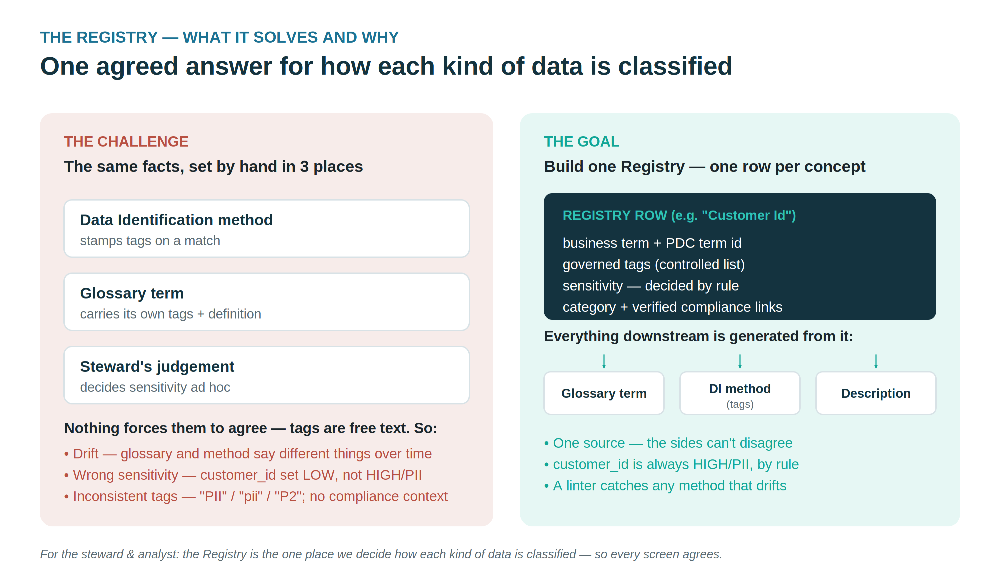

# Glossary Generator — Guide

A local web app that scans data sources, profiles the data, suggests Business
Glossary terms, lets you review and govern them, and exports import-ready JSONL
for **Pentaho Data Catalog → Business Glossary → Import**. One glossary can span
several sources (a database plus a document store).

This is the app's **one consolidated manual** (1.8.x): the why, the setup, the
walkthrough, and the operating notes that used to live in separate files
(`CHALLENGE-AND-GOAL.md`, `INSTALL.md`, `SUPPLEMENT.md` — merged here).

- **Part A — The why: the Registry** · the thesis in plain language
- **Part B — Install & set up** · lab quick-start and full setup against your own PDC
- **Part C — Using the app** · every page and workflow
- **Part D — Operating against a real PDC** · run order, lifecycle, and write semantics

---

## Part A — The why: the Registry

*For the Data Steward and the Business Analyst. Plain language, no code.*



### The challenge

In PDC, the same three facts about a column — **which business term it maps to**,
**what tags it carries** (like `pii`), and **how sensitive it is** — get decided
in more than one place, by hand, at different moments:

- the **Data Identification method** (a dictionary or pattern) stamps tags when
  it matches a column;
- the **glossary term** carries its own tags and definition;
- the **steward** decides sensitivity based on judgement.

Nothing in PDC forces these to agree — tags are free text on both sides. So you
get **drift** (glossary and method quietly diverge), **wrong sensitivity**
(`customer_id` guessed LOW when it should be HIGH / `pii`), and **inconsistent
tags with no compliance context** (`PII` vs `pii` vs `P2`). The result: you
can't be confident a classification is **correct, consistent, or defensible in an
audit**, and you reconcile the same facts across several screens.

### The goal — build a Registry

Create **one list**: the **Registry**. **One row per concept**
(phone, member id, card number, loan balance, …). Each row is the
single, agreed answer for that concept:

- its **business term** (and, once created in PDC, the **term id**);
- its **governed tags**, chosen from a controlled list — so no more `pii` vs `PII`;
- its **sensitivity**, decided **by rule** against a standard — so `customer_id`
  is *always* HIGH / `pii`;
- its **category**, any **verified compliance links**, and how to build its
  Data Identification **method**.

> **In one sentence:** the Registry is the one place we decide how
> each kind of data is classified — so every screen agrees and every
> classification is defensible.

### Two apps, one handoff

The Registry is the **contract between two separate apps**, used in
order. Keeping them distinct matches PDC's own separation of the Business Glossary
from Data Identification.


**1 · Glossary Generator (first)** builds the **business glossary**. It scans
sources, proposes candidate concepts, lets the steward review them, and imports
the glossary into PDC (which mints the term ids). In doing so it **authors the
Registry** — the concepts, their governed tags, sensitivity, and
references — and the registry is **saved with the glossary**.

**2 · Policy Generator (next)** builds the **Data Identification policy**. It
**reads the Registry** (with the reconciled term ids) and emits the
Data Identification methods — **dictionaries** (imported as ZIPs of JSON + CSV)
and **patterns** (JSON) — each bound to its term and stamping the registry's tags.
This is what **creates the policy, keeps tagging consistent, and fills the
coverage gaps**, then flags any method that has drifted.

> **The registry exists for Policy Generator.** The Glossary Generator *writes*
> it as a by-product of building the glossary; Policy Generator *reads* it to
> build the policy. One app does glossary work, the other does Data
> Identification work — the registry is the bridge.

A note on the word *policy*: in PDC there is no separate Policy object. A **Data
Identification policy is simply the combination of dictionary and pattern methods**
a steward chooses to enable. The Policy Generator app builds those methods; the steward's
selection is the policy.

*All example data is fictional and generated for training.*

---

## Part B — Install & set up

### Quick start (lab / local)

```bash
cd glossary_generator
python3 -m venv .venv && source .venv/bin/activate      # optional
pip install -r requirements.txt
python -m uvicorn api:app --port 5000                    # http://127.0.0.1:5000
```

Override host/port: `./run.sh --host 0.0.0.0 --port 5050` (or `PORT=5050
HOST=0.0.0.0 ./run.sh`). `run.sh` does venv + install + run in one step. On Windows use `run.ps1` (or the `run.bat` wrapper) instead. PostgreSQL, DDL and MinIO/S3 scanning work out of the
box; other DB engines are opt-in (see **Settings → Drivers**). LLM enrichment is
optional and needs a local **Ollama** (`ollama serve`).

The interface is a four-section dashboard: **Home · Connections · Glossary ·
Govern · Settings**.

*App version **1.9.x** · validated against **Pentaho Data Catalog 11.0.0**.*

This guide stands the **Glossary Generator** app up against *your* Pentaho Data
Catalog (PDC) instance — your data sources, your accounts, your network. The app
ships **generic** (no scenario vocabulary baked in); a scenario is installed from
its domain pack. This guide uses **Copper State Credit Union (CSCU)** — the
financial-services scenario — as the worked example throughout.

> **What the app needs from PDC.** The app scans your sources locally and then drives
> PDC's **public API** to resolve terms, apply governance, and calculate Trust Score.
> It does **not** create the glossary over the API — you import the generated glossary
> through the PDC UI once, then the app attaches terms to columns. So a reachable PDC
> instance with public-API access and an account that can edit the glossary is the
> core requirement.

---

### 1. Prerequisites

**A host for the app.** A Linux/macOS/Windows machine or VM that has network line of
sight to three things: your PDC instance (HTTPS), each database you'll scan (e.g.
PostgreSQL on 5432), and any object store you'll scan (MinIO/S3 endpoint). For the CSCU
lab this is typically the same VM the catalog work is done from.

**Python 3.9+** — the launchers (`run.sh` / `run.ps1`) create an isolated
virtualenv beside the app.

**A running PDC instance** with the public API enabled and reachable over HTTPS. This
guide is validated against **PDC 11.0.0**; confirm your version's API segment (`v2`
vs `v3`) from its Swagger — entity/search shapes are stable across both, but the
`jobs` endpoints (Trust Score, Data Discovery) are richest in `v3`.

**A PDC account.** `admin` / `system_administrator` works for everything; a **Business
Steward** is enough for glossary edits and is the safer least-privilege choice. PDC
fronts identity with **Keycloak** (realm `pdc`, client `pdc-client`); the same account
works whether you authenticate through `/api/public/<v>/auth` or straight against
Keycloak.

**Source credentials.** Read-only database credentials for each source you'll scan
live (or a `CREATE TABLE` DDL file if you can't reach the database), and access
key/secret for any MinIO/S3 object store.

**Optional — Ollama** for one-sentence definition/purpose enrichment. It's the only
non-local, and entirely optional, step in the pipeline; everything else runs without
it. Budget ~4 GB for the default `llama3.2:3b` model (a GPU helps but CPU works).

---

### 2. Configure for your scenario (domain pack + company name)

The generic engine ships with no scenario vocabulary. Two settings tailor it without
touching code:

- **`GLOSSARY_COMPANY`** — the organization name woven into the LLM enrichment prompts
  (default: "your organization").
- **`GLOSSARY_DOMAIN_PACK`** — path to an optional JSON of scenario vocabulary
  (table→category, table→term, keyword rules, abbreviations, category definitions).
- **`credit_union.people.json`** — a companion **people/steward roster** for the CSCU
  scenario (`{"people": [...]}`: `display_name`, `email`, `name`, `roles`,
  `expertise`, `owns`, …). Import it to seed the stewards who own glossary terms.
- **`CLASSIFICATION_DOMAIN_PACK`** — path to an optional JSON that overlays
  **industry classification concepts** (term + tags + sensitivity + category +
  column-name detection) onto the generic PII/PCI/PHI core. This drives the
  registry that Policy Generator and the drift linter share. Example packs ship
  for both scenarios; copy and swap for any sector — no code changes.

For **CSCU**, the simplest install is the pack zip — unzip
`CSCU/cscu-domain-pack.zip` from the PDC-Scenarios repo
(`data_sources/CSCU/`) into `glossary_generator/` (it drops
`domain_pack.json`, auto-loaded, plus the `people.json` roster), then set:

```
GLOSSARY_COMPANY="Copper State Credit Union"
```

The same pack can be referenced in place instead:

```
GLOSSARY_DOMAIN_PACK=/path/to/PDC-Scenarios/data_sources/CSCU/domain_pack/credit_union.example.json
```

The CSCU vocabulary covers Member Record, Loan Record, KYC Review Record, the
`mbr`/`apr`/`ach` abbreviations, and the pci/aml/lending tag rules. For a different
customer, copy the pack, edit the vocabulary, and point at your copy. See
`glossary_generator/domain_packs/README.md` for the key reference.

---

### 3. Install — native (Windows 11 / macOS / the Ubuntu lab VM)

The app installs natively — no container. On Windows use `run.ps1` (or
`run.bat`); on macOS and the lab VM use `run.sh`.

1. **Unzip** and `cd` into the app folder.

2. **Export your scenario values**, then launch with the bundled launcher (it creates
   a virtualenv, installs dependencies, and runs):

   ```bash
   export GLOSSARY_COMPANY="Copper State Credit Union"
   ./run.sh                 # http://127.0.0.1:5000
   ./run.sh --host 0.0.0.0  # bind all interfaces (e.g. on a lab VM)
   ./run.sh --port 8080     # choose a port
   ```

   (Scenario vocabulary: unzip PDC-Scenarios' `data_sources/CSCU/cscu-domain-pack.zip` into the
   app folder first, or export `GLOSSARY_DOMAIN_PACK` pointing at the pack file.)

   `run.sh` does a pre-flight check (Python version, free port, whether Ollama is
   reachable) before starting, and skips the dependency reinstall on repeat runs.

   Alternatively, run it by hand: `pip install -r requirements.txt` then
   `python -m uvicorn api:app --port 5000`.

---

### 5. First run — smoke test

Confirm the process is healthy and your configuration took effect:

```bash
curl http://localhost:5000/health     # {"status":"ok", "ollama":{...}}
curl http://localhost:5000/config     # effective paths + env (secrets masked)
```

`/health` returns 200 whenever the app is up; the `ollama` block reports the
enrichment backend, which is allowed to be offline. `/config` echoes the resolved
paths, the default model, and your `GLOSSARY_*` variables (anything secret-looking is
masked) — a quick way to confirm the domain pack and company name are wired in.

Then open **`http://<host>:5000`** in a browser.

---

### 6. Point it at your PDC instance

In the UI, open **Glossary → Data Elements (links)** to reveal the PDC panel.

1. **Base URL** — `https://<your-pdc-host>` (no trailing `/api/...`; the app adds the
   path). For self-signed lab certificates, the app exposes a *verify TLS* toggle —
   the underlying calls correspond to `curl -k`.
2. **Version** — `v2` for entities/search; `v3` for the richest jobs surface. Confirm
   against your instance's Swagger.
3. **Username / password → Get token.** The app authenticates, fills the token field,
   and shows the signed-in user, whether the account carries an admin role, and the
   expiry countdown. Verify the **admin ✓** (or your expected Business Steward) badge,
   and that the expiry covers your run. The token is held **in memory only**, never
   persisted; the app re-authenticates on a 401.

The call underneath, for reference:

```
POST https://<host>/api/public/v2/auth        (application/x-www-form-urlencoded)
  username=<user>  password=<pwd>  client_id=pdc-client
  grant_type=password  scope=openid profile email
200 -> { "data": { "accessToken": "eyJhbGciOi..." } }
```

---

### 7. Add your data sources

On the **Connections** screen, add one connection per source:

- **Database (live scan)** — PostgreSQL / MySQL / SQL Server, **read-only**. Reads
  schema, keys, and comments; sampling refines sensitivity and data quality. CSCU's
  source schema is `cscu_core` (your real schema name; the app no longer assumes
  it — set it on the connection).
- **Object store (MinIO/S3)** — browses a bucket over the S3 API; each file becomes a
  document term. **Use the host/VM IP for the endpoint, not `localhost`** — inside a
  container or from another host, `localhost` points at the wrong place.
- **DDL file** — parses a `CREATE TABLE` script when you can't reach the live
  database; same suggestions, no connection.

**Bulk-load the connections.** A starter CSV is downloadable from the app
(`/api/pdc/bulk-load/sample.csv`) or shipped as `datasources.sample.csv`. The CSCU
scenario also ships **`data_sources/CSCU/cscu-datasources.csv`** (PDC-Scenarios repo) — the same format
pre-filled with the two CSCU lab connections, ready to load:

| kind | resourceName | reaches |
| --- | --- | --- |
| `postgres` | `CopperState_Core_Banking` | `192.168.1.200:5433` (shared `demo-postgres`, published on 5433) · db `cscu_core` · user `pdc_user` · schema `cscu_core` |
| `minio` | `CopperState_Documents` | `http://192.168.1.200:9000` · bucket `cscu-documents` · path `/` |

The credentials in it are the **lab values** (`catalog123!`, `minio_secret_123!`) — change
them for anything beyond the lab. Use the **VM/host IP** for the MinIO endpoint (not a
container name) so S3 path-style is forced, which MinIO requires. Each source still needs a
successful **Test Connection** before it comes online.

---

### 8. Before you run it — where it fits in PDC's order

The app **rides on PDC's data scan**: it confirms and overrides the tags and
sensitivity that **Data Identification** produces, then layers stewardship, term
links, and Trust Score on top. So complete PDC's scan **first**:

```
Ingest -> Profile -> Identify (+PII) -> import the glossary -> Reconcile term ids
  -> emit/deploy methods -> Resolve -> Apply -> Drift check -> Calculate Trust Score (last)
```

Three rules that matter on a real instance: **identify once** (re-running Data
Identification after the app clobbers the steward's overrides); **tags merge, sensitivity
overwrites** (the app reads-merges-writes the tag array so it never wipes auto-tags);
and **Trust Score last** (it rolls up everything else, so calculate it after all other
inputs are final). The Workshop and its supplement cover this in full.

> **Drift is a post-reconciliation view (1.6.0).** The drift linter compares a
> deployed Data Identification method's tags against the Registry.
> A dictionary method binds to a concept by `dictionaryTermId`, which only exists
> once the reviewed glossary has been imported into PDC and its minted ids read
> back and reconciled into the registry. So drift on dictionary methods can only
> be assessed **after** that reconcile step — before it, they read as UNKNOWN.
> Pattern methods bind by category and can be checked a step earlier.

> **Reversible review, dynamic per-group resolution, table terms protected (1.5.7).** In
> the Review & prune grid, duplicate names cluster under an inline header with a three-way
> **Merge / Disambiguate / Keep separate** control (the selected option is highlighted and
> reverts on a second click); detection is dynamic, so groups update as you rename inline
> or cull. *Keep High+Med conf*, *Merge duplicates*, *Auto-disambiguate* and **Reset all**
> are reversible toggles. **Table terms are never grouped, merged, culled, or deleted** —
> even if a table term shares a name with a real duplicate group. Resolutions survive a
> later LLM enrich, so applying the LLM after merging is safe.

---

### 9. Security & operations

- **Least privilege.** Prefer a **Business Steward** account over admin for glossary
  edits.
- **Secrets.** The app keeps the PDC token in memory for the run only and never writes
  it to disk. Don't commit real credentials; the sample CSV and compose file ship with
  `CHANGE_ME` placeholders.
- **Registry persistence (1.6.1).** The Registry saves beside the
  glossary as `registry.<glossary>.json` and reloads on open, so reconciled term
  ids and learned concepts survive restarts — required for drift detection to work
  across sessions. Back it up with the rest of `/data`.
- **State.** The `people/connections/settings/glossaries` JSON files sit beside
  the app unless you redirect them with the `GLOSSARY_PEOPLE` /
  `GLOSSARY_CONNECTIONS` / `GLOSSARY_SETTINGS` / `GLOSSARY_GLOSSARIES`
  variables. Back them up if you've curated a roster (or use
  **Settings → State snapshot**, which zips the lot).
- **TLS.** PDC is HTTPS; for self-signed lab certs use the app's verify-TLS toggle. In
  production, use a trusted certificate and leave verification on.
- **Dry-run on a new instance.** The first time you point the app at a PDC instance,
  treat the **Apply** dry-run as mandatory — preview every PATCH before a single write.

---

### 10. Troubleshooting

| Symptom | Likely cause / fix |
|---------|--------------------|
| `/health` shows `ollama` offline | Expected if you're not using enrichment — it's optional. |
| `401` mid-run | Token expired; the app re-auths automatically, or click **Get token** again. |
| Object store unreachable | You used `localhost` — use the host/VM IP for the S3 endpoint. |
| `Route not found` (404) listing data sources | Expected — the public API has no "list all sources" call; the app discovers them via `entities/filter`. |
| Term **Resolve** finds nothing | The glossary hasn't been imported into PDC yet. The order is **import -> resolve -> apply**. |
| `400` on **Apply** | Usually an unexpected field on a term; the app whitelists term keys, so confirm you're on a current build. |
| `v2` jobs endpoint missing | Trust Score / Data Discovery live on `v3` — switch the version segment. |
| Suggestions use the wrong vocabulary | Check `GLOSSARY_DOMAIN_PACK` is set and the path is correct (`/config` will show it). |
| `500` on **enrich** — `AttributeError: 'NoneType' object has no attribute 'get'` (`llm.py` → `enrich_rows`) | A null/blank row reached the enricher — usually a table-level term arriving as an empty slot. Fixed in **1.5.6** (rows are guarded in `enrich_rows` and filtered at the `enrich()` boundary); upgrade, or apply the guard from `CHANGELOG.md`. |
| A table term disappears after **Keep High+Med conf** | Pre-1.5.6 behaviour. Table terms are now kept by default and exempt from the confidence cull — upgrade to 1.5.6. |

---

### 11. Upgrading & uninstalling

- **Upgrade:** replace the files (or `git pull`) and re-run `run.sh` /
  `run.ps1`; dependencies reinstall only when `requirements.txt` changed. Then
  restart the app and click the version pill — it flags a stale build.
- **Uninstall:** delete the app folder and its `.venv`.

---

*All Copper State Credit Union (CSCU) data in the training scenario is fictional and generated for training.*

---

## Part C — Using the app

### 2. Home

Landing page: the four-step workflow (Connect → Review &amp; prune → Govern &amp;
generate → Apply to PDC), best-practice notes, and your **Saved glossaries** (load
or delete any saved workspace — see §7).

---

### 3. Connections

Each source is its own **saved connection** (persisted to `connections.json`).

Types: **Database (live scan)**, **Document store (MinIO/S3)**, **DDL file (path)**.

Per database connection card:

| Action | What it does |
|---|---|
| **Scan** | Suggest terms (replaces the current list) — start a glossary here |
| **Add to glossary** | Scan and **merge** into the current list — span multiple sources |
| **Discover** | Full column profiling (see §3.1) |
| **Seed data** | Populate empty tables with realistic sample data (see §8) |
| **Test** | Verify the connection |
| **Edit / Delete** | Manage the saved connection |

> **Multi-source glossaries.** A PDC glossary is source-agnostic — terms are
> business concepts. Scan your database, then **Add to glossary** from the MinIO
> bucket; a *Sources* chip shows the split (e.g. `Database 110 · Document store 21`).

**Profile data** toggle (on a DB connection): samples real column values on scan
to set sensitivity, PII and CDE from the data — not just the column name.

#### 3.1 Data discovery (compare with PDC)

**Discover** runs real profiling SQL and renders a column-profiling panel:

- **Summary**: tables, columns, total rows, PII columns, CDE columns, empty tables.
- **Per-table** (expandable): per-column **completeness %**, **distinct**,
  **uniqueness %**, **sensitivity**, **PII**, **CDE**, **detected type**
  (email / phone / zip / date / decimal / identifier / enum), PK/FK, and examples.

These are the same dimensions PDC's profiler captures (completeness, cardinality,
patterns, sensitivity), so you can line the two up side by side.

#### 3.2 Harvest from PDC (no direct DB access)

Instead of connecting straight to the database, you can build the glossary from
what **PDC has already cataloged**. The **Harvest from PDC** card on Connections:

1. **List data sources** — the public API has no "list all data sources" call
   (the data-sources endpoint is retrieve-by-id only), so the picker reads the
   harvestable roots (schemas / sources) from `POST /entities/filter` — the same
   endpoint Resolve and Apply use. Authenticate with a username/password or paste
   a **bearer token**; every PDC call is sent with `Authorization: Bearer <token>`.
2. **Harvest selected** — calls `POST /entities/filter` for the chosen source's
   `COLUMN` entities and reads PDC's real metadata (`metadata.column.dataType` /
   `isPrimaryKey` / `isNullable`, `attributes.info.description`). PDC's description
   **becomes the definition** (High confidence), and any column PDC **already
   governs** (`attributes.features.sensitivity` / `trustScore`,
   `attributes.businessTerms[]`) is flagged with an **"in PDC"** badge so you don't
   overwrite existing work.

This is the most PDC-native path: the catalog is the source of truth and the
generator reads from it. Endpoints live in the shared `pdc_client/` package
(`list_data_sources`, `harvest_from_catalog`) and `api.py`
(`/api/pdc/data-sources`, `/api/pdc/harvest`); the "Under the hood — reading
PDC's catalog" panel shows the exact calls.

> **PDC base URL = the server root** (e.g. `https://192.168.1.200`). The app adds
> `/keycloak/realms/<realm>/…` and `/api/public/v2/…` itself. Pasting the full
> Keycloak realm URL (`…/keycloak/realms/pdc`) is tolerated — `pdc_api.clean_base`
> strips it (and recovers the realm) so the request isn't built with a doubled path.

#### 3.3 Bulk-load data sources into PDC (no glossary work — a setup step)

Where 3.2 *reads* from a catalog PDC already scanned, this *writes* the sources in
the first place. It is the **Connect + Ingest** step that precedes profiling,
identification and the glossary — handy when you are standing up a lab or a
customer environment and need many sources registered at once.

Paste or choose a **CSV** (one row per source) and the panel, for each row:

1. **creates** the data source — `POST /api/public/<v>/data-sources`
2. runs a **test-connection** job and waits for it — `POST /jobs/execute/test-connection`, then polls `GET /jobs/{id}/status`
3. triggers a **metadata ingest** — `POST /jobs/execute/metadata/ingest`, scoped to the new record's `resourceId`

Progress streams back a row at a time (create / test / job / ingest), exactly like
the summary table the original PowerShell script printed.

**CSV columns.** `kind` selects the connector — `postgres`, `minio`/`s3`, or
`azure_blob` — and only the relevant columns are read:

| kind | required columns |
|------|------------------|
| `postgres` | `resourceName, host, port, databaseName, userName, password` (`schemaNames` optional) |
| `minio` / `s3` | `resourceName, endpoint, accessKeyID, secretAccessKey, container` (`path`, `region` optional) |
| `azure_blob` | `resourceName, accountName, azureSharedKey, container` |

Optional everywhere: `description, fqdnId, affinityId, configMethod, path,
includePatterns, excludePatterns`. Download a starter file from the panel link
(`/api/pdc/bulk-load/sample.csv`) or use `datasources.sample.csv` in the app
folder — it has two sample sources (a `public`-schema database and a
`documents` MinIO store) with `CHANGE_ME` where the secrets go.

> **Dry run** builds and shows the (redacted) request bodies without contacting
> PDC — use it to check a CSV before sending. Secrets are transmitted to PDC only;
> the app never writes them to disk or logs. Creating data sources needs an
> account with the rights to do so (e.g. Data Storage Administrator).

The same engine is callable headless: `POST /api/pdc/bulk-load` with
`{base_url, username/password or token, csv, options:{test,ingest,wait}, dry_run}`.

---

### 4. Glossary

Review and refine the suggested terms, then generate.

- **Columns**: Keep · Category · Term · Definition · **Purpose** · Sensitivity
  (colour-coded: HIGH red, MEDIUM orange, LOW teal) · CDE · Tags · Confidence · Source.
- **Filters**: text, category, sensitivity, confidence, **tags**, PII-only, kept-only.
- **Keep controls**: master tri-state, shift-select ranges, *Keep High+Med conf*.
- **Open glossary for review…** — load an existing export straight into the grid.
- **Enhance from glossary…** — overlay an export's real definitions/purpose/tags/
  sensitivity onto matched terms (and add any the scan missed).
- **Enrich with LLM** — rewrite definitions with the local model.
- **Save glossary / Load saved…** — see §7.
- **Generate JSONL** — exports the kept terms. This now lives on the **Govern**
  page (its **Generate &amp; apply** card), not the Glossary page, because
  stewardship and ratings are written into the JSONL at generate time — so you
  always Govern before you Generate. The Glossary page hands off to Govern with a
  **Set stewardship →** button. The glossary need not exist in PDC yet — UUIDs come
  from the Keycloak roster.

**Confidence** is an evidence signal, not a quality score:
**High** = DB comment, key, or a profiling hit; **Medium** = PII pattern or
low-cardinality; **Low** = templated from the name. Raise it by profiling, adding
DB column comments, or enhancing against an existing glossary.

**How the Term name is derived (and cryptic columns).** Each column becomes one
candidate Term by humanising the column name — underscores to spaces, Title Case —
*plus* an abbreviation-expansion map so cryptic names still read well:
`cust_acct_no` → "Customer Account Number", `txn_dt` → "Transaction Date",
`inv_amt` → "Invoice Amount" (covers generic forms like no/num→Number,
acct→Account, amt→Amount, qty→Quantity, dob→Date of Birth). A domain pack can add
scenario abbreviations (e.g. mbr→Member, apr→APR). Anything not in the map falls
through to plain Title Case, so a truly opaque name (`x1`, `col_007`) still yields a
weak name you can edit. Expansions are only suggestions — every Term cell is editable.

**LLM-suggested rename.** When you **Enrich with LLM**, the model also proposes a
clearer Term name for columns it judges cryptic (and repeats the name unchanged when
it already reads well). It is shown as a clickable **&#8594; chip** next to the Term —
clicking it adopts the name; it is **never** written over your Term silently. The
enrich summary reports how many names were suggested. The model only rewrites the
*definition* and *purpose* automatically; the *name* always waits for your click.

**CDE (Critical Data Element)** is auto-inferred from keys, sensitivity, financial/
identity PII, profiled identifiers, and critical/compliance/safety terms (account
number, licence, permit, meter, balance, compliance, lead/pH/turbidity, capacity…).
Always reviewable per row by the steward.

---

### 5. Govern

- **User roster** — add/remove people, set each person's **Expertise** (free text
  + keywords), Save roster (persists to `people.json`). People bind to PDC accounts
  by **UUID** (per-instance, from Keycloak).
- **Fetch users from Keycloak** — pull the roster live from Keycloak's Admin API
  (base URL + realm + admin user/password, or a bearer token).
- **Stewardship defaults** — business steward, owner, custodian, status, rating,
  reviewed-date, stakeholders — applied to every kept term (and category), with a
  **per-category steward** override (pre-filled from MinIO owner tags / `owns` map).
- **Auto-assign all slots** — keyword-matches each person's role + expertise (+ a
  small domain-synonym map) against each category's label, term and column names,
  then fills the steward / owner / custodian slots. Role badges gate each slot
  (Business Steward → steward, Data Steward → owner, Data-Storage Admin → custodian);
  with the fallback toggle on, an empty role pool falls back to expertise-only.
  Deterministic and offline. Each pick shows a confidence + the matched terms, and
  slots you set by hand are **locked** so they're never overwritten ("Clear auto"
  unlocks the auto-filled ones). Manual edits always win.
- **Auto (scan DQ) rating** — on the global and per-category Rating dropdowns,
  derives 1–5 stars from the scanned Data Quality (mean of the per-column DQ scores):
  ≥97 % → 5, ≥90 → 4, ≥80 → 3, ≥70 → 2, else 1. When the global rating is Auto,
  every category is rated on **its own** mean DQ. Resolved to a concrete integer at
  export, so the JSONL and Trust-Score rollup are unchanged.

These flow into the generated JSONL (`info.owner/custodian/businessSteward`,
`stakeholders`, `features.rating`, `reviewedAt`, `status`).

---

### 6. Settings

- **Local LLM (Ollama)** — model picker, GPU offload (Auto/Max/Off), pull model
  with progress.
- **Database drivers** — per-engine Python driver status + install command, and the
  PDC JDBC-jar hint.
- **Appearance** — theme (Light / Teal / Dark, applied live) and the help banner.

Settings persist to `settings.json`.

---

### 7. Saving & loading glossaries

**Save glossary** (Glossary page) stores a named **workspace** — its terms,
governance settings and the data-discovery profile — to `glossaries.json`.
Reload it anytime from **Home → Saved glossaries** or the **Load saved…** dropdown;
the grid, summary, discovery panel and governance selections are all restored.

---

### 8. Seeding sample data

Value-based profiling needs representative rows. `seed_sample.py` is a
schema-introspecting generator: it reads `information_schema`, orders tables by
foreign-key dependencies, skips auto-increment keys, references real parent PKs for
FK columns, and generates realistic values by column name/type (emails, phones,
`ACC########` account numbers, names, addresses, ZIPs, status/type enums, amounts,
dates).

In the app: the **Seed data** button on a database connection (fills empty tables,
then re-runs Discover). From the CLI:

```bash
python seed_sample.py --host localhost --port 5433 --db your_db \
                      --user db_user --password 'CHANGE_ME' --rows 200
# --all also tops up non-empty tables
```

---

### 9. Adapting to your scenario

The engine is scenario-agnostic. Two knobs tailor it without code changes:

- **`GLOSSARY_COMPANY`** — the organization name woven into the LLM prompts
  (defaults to "your organization").
- **Domain pack** — an optional JSON of scenario vocabulary (table→category,
  table→term, keyword rules, abbreviations, category definitions). Point at it with
  `GLOSSARY_DOMAIN_PACK=path/to/pack.json`, or drop `domain_pack.json` beside
  `suggester.py`. The **Copper State Credit Union** pack ships with a
  ready-to-install zip (PDC-Scenarios' `data_sources/CSCU/domain_pack/`). See
  `glossary_generator/domain_packs/README.md` for the pack format.

Connections, buckets, and the glossary name are all set in the app UI or via the
`GLOSSARY_*` environment variables (see the table in §1).

---

### 10. Import into PDC

Terms export as **Draft** (proposals until a Business Steward accepts them). The
import **replaces the whole glossary** — to update in place, open the existing
export for review so the `_id`s are reused. In PDC: **Glossary → Actions → Import**.

Before importing, the **Check PDC** button next to the glossary name (Govern page)
calls `POST /api/pdc/glossary-exists`, which searches PDC for a glossary of that
name. It warns if an exact match already exists (so you update rather than
duplicate) or if a similar one is present.

**Apply to PDC** (the resolve → merge → PATCH path) writes business-term links and
features back onto existing column entities. Before each PATCH, every business term
is reduced to the keys PDC's schema accepts — `id`, `glossaryId`, `name`,
`sourceName`, `sourceType`, `confidenceScore`. App-internal fields (e.g. the
`glossary` display name) are dropped; sending them makes PDC reject the PATCH with a
`400`. Existing links on the column are preserved — new terms are unioned in,
never replaced.

---

### 11. Working in the UI — wayfinding & feedback

A few aids make the pipeline easier to follow:

- **Workflow stepper.** A thin strip at the top of every working page tracks
  *Connect → Review → Govern → Apply*, one stage per nav page (Connections,
  Glossary, Govern, Apply to PDC). Generate isn't a separate stage — it's an
  action on the Govern page. Each stage lights up as it's
  satisfied (a connection exists, terms are scanned, a steward is set, JSONL is
  generated, an apply has run) and is clickable to jump straight there. It's hidden
  on Home and Settings.
- **Apply progress bar.** Apply to PDC streams its progress live — the bar fills
  column by column ("Resolving & patching column 14 of 52 · …"), then shows the
  table-rating roll-up and Trust Score phases. It falls back to a single request if
  streaming isn't available. The underlying write logic is unchanged; the stream
  only reports progress.
- **How terms are built (Glossary page).** A "How terms are defined & built"
  panel explains where each field comes from — Term (humanised column name),
  Definition (DB comment → key text → template), Purpose, Sensitivity (name
  patterns, overridden by value profiling), CDE, Tags, and Confidence (an evidence
  signal). All of it is derived locally by `suggester.py` at scan time — no extra
  API calls — with `View source` to read the exact logic.
- **Plain-language explainers.** Several pages carry a short explainer card:
  *Connection types & what each button does* (Connections), *How terms are
  defined & built* (Glossary), *How stewardship & auto-assign work* (Govern), and
  *Why generate & import before you resolve* (Resolve Term IDs). The exposed
  source (`/api/source` / View source) is also commented for learners — the
  term-building heuristics in `suggester.py` in particular.
- **Under the hood — on every stage.** Each working page has a collapsible
  *Under the hood* panel showing the exact calls it runs, built from your own
  settings: **SQL** (information_schema + pg_catalog) on Connections, the **S3**
  ListObjectsV2/GetObject calls on Files, the local `/api/generate` plus the
  **Ollama** enrichment call on Glossary, the **Keycloak** admin token + users
  fetch on Govern, and the full **PDC public-API** choreography on Apply. Secrets
  are masked; every call has a Copy button. Each panel also lists the **scripts**
  that run it with a **View source** button — the real Python is served read-only
  from a whitelist (`/api/source`), so a learner can read exactly what executes.
  Nothing with secrets (people.json, settings) is ever exposed.
- **Why import before resolve.** The Apply page opens with a short explainer: a
  term link binds to its glossary only when it carries both `id` and `glossaryId`,
  and those exist only after the term exists in PDC — i.e. after you import the
  generated JSONL. Hence the forced order Govern → Generate → Import → Resolve →
  Apply.
- **Roster filter & validation.** The Govern roster has a filter box (name, email,
  expertise) for large Keycloak pulls. The add-person row validates UUID
  (8-4-4-4-12 hex) and email format before *Add* is enabled, and **Enter** submits.
- **Unsaved-roster nudge.** Editing expertise, adding, or removing a person marks
  the roster dirty (an "unsaved" dot by *User roster*); the browser also warns
  before you navigate away. *Save roster* clears it.
- **Copy JSONL.** The Generate output has a *Copy JSONL* button next to the
  download link.

---

### 12. Runtime files (git-ignored)

`connections.json`, `settings.json`, `glossaries.json`, `people.json` hold your
saved state. They're local to the app folder, survive `git pull` untouched,
and self-heal across app versions. **Settings → State snapshot** zips all of
it (plus the dictionary, audit trail, Registries and installed pack) for
backup or a machine move, and restores it with per-file backups. The app
auto-resumes your last saved glossary on start — Save glossary is the one
click that keeps grid work.

---

### The working cycle — exact order

One complete pass, from scan to a Registry the Policy Generator can consume.
The order matters because each step feeds the next:

1. **Scan or resume.** Connect & scan, or let the app auto-resume the last
   saved glossary.
2. **Review the grid.** The AI agents assist (Enrich, AI suggest (evidence),
   AI QA, AI categorize — fills only blank/generic categories); the duplicate
   advisor recommends Merge / Disambiguate / Keep separate. Rename divergent
   names to their canonical term — aliases fold them automatically on future
   scans.
3. **Dictionary: review pending.** *AI review* advises per candidate; alias
   folds near-duplicates. Approve only what belongs — approved items govern
   the Registry and export into the pack. Mistakes reverse per item
   (✕ retire / ⤵ fold); a retire is **durable** (tombstoned through reseeds,
   offered for pack removal at export).
4. **Suggest tags** (grid) after any vocabulary change — re-derives row tags
   from the governed allow-list and accretes usage into the facet preview.
   Freshly reseeded counters are all zero: that means "no scan yet", never
   "retire everything" (the bulk retire button is gated until the dictionary
   has grown from a scan).
5. **Govern** — roster-driven stewardship, ratings, review dates.
6. **Save glossary → Generate** (writes the JSONL **and the Registry**) →
   PDC **Business Glossary → Import** (if terms were *renamed*, delete the
   old glossary first — ids are name-based, renames mint new terms) →
   **Resolve & stamp IDs** (backfills real ids into the Registry) →
   **Apply to PDC**.
7. **Export domain pack → Apply to this app → commit** — last, because it
   exports the *reviewed* state of everything above. Decide the conflict
   rows; Apply writes the pack **and reseeds the dictionary in one click**
   (never run Reseed separately unless you hand-edit the pack file); commit
   the pack to the scenario repo.

After step 6 the Registry is current; after step 7 the flywheel is closed.
`Save dictionary` is only needed after hand-editing tags/rules — approvals
and scan accretion persist on their own.

### The pack generator (Dictionary → Export domain pack)

After a full scan + review cycle, **Export domain pack** exports the reviewed
state back into pack format: table mappings, learned abbreviations, the
governed company vocabulary, and `curated_seeds` carrying the induced value
patterns and profiled reference lists — detection seeds specific to this
company. It **merges over the installed pack**: additions fill gaps, and any
**disagreement** between scan and pack is listed with a checkbox per row so
the steward picks the winner (curation keeps the pack's value by default;
`curated_seeds` default to the fresher scan evidence). **Apply to this app**
writes it and reseeds the dictionary in one click (approved items survive), (Steward-retired entries are tombstoned — durable through
reseeds — and the export offers to remove them from the pack, so an
over-eager Approve-all is recoverable per item with the ✕/⤵ actions.)
and committing the file to the scenario repo makes the next install start
from evidence instead of guesses. No pack yet? Run packless, scan + review
once, and the first export **is** your base pack.
Full detail: `glossary_generator/domain_packs/README.md`.

---

## Part D## Part D — Operating against a real PDC

### Why it runs after Data Identification, not at the Workshop 3 manual-glossary slot

The manual glossary (Workshop 3) authors tags and sensitivity *by hand*, so it has no
data-scan prerequisite. The app is different: it **rides on PDC's data scan** — it
confirms and overrides the dictionary/pattern tags and sensitivity that **Data
Identification** produces. That means the PDC processing chain has to be complete first:

```
1  Connect            (Workshop 1)
2  Metadata Ingest    (Workshop 2 — structure & metadata)
3  Data Profiling     (statistics, keys, data-quality pre-analysis)
4  Data Identification + PII   (dictionary/pattern tags + auto-sensitivity)
5  Glossary Generator App  ← this step: steward confirms/overrides, links terms,
                             sets CDE / verified lineage / rating, Calculate Trust Score
```

Running Identification first also satisfies PDC's **Required** gate (Identification
cannot run on an unprofiled table), so the app starts from a complete, confidence-scored
baseline and the steward curates it.

### Lifecycle — read before you run it

- **PDC sets the baseline, the steward overrides.** Let Data Identification apply its
  dictionary/pattern tags and sensitivity once; the app is how the steward corrects them.
- **Identify *once*.** Re-running Data Identification after the app re-fires its
  dictionary/pattern actions and clobbers the steward's overrides. Treat Identification
  as a one-time baseline before this workshop, then don't re-run it.
- **Review is subtractive, per-term, and reversible.** Every column arrives as a candidate
  term, so you prune rather than hunt. Duplicate names cluster under an inline header with
  a **Merge / Disambiguate / Keep separate** control (detection is live as you edit/cull);
  *Keep High+Med conf* / *Merge duplicates* / *Auto-disambiguate* highlight when applied
  and revert on a second click; **Reset all** returns to the raw scan. Table terms are
  never grouped, merged, or deleted.
- **Table terms are kept by default.** A table-level term (e.g. *Customer Record*) is the
  fourth Trust Score input, so the confidence cull never drops it — only an explicit
  steward action does. Filter by confidence to triage columns, not to remove table terms.
- **Tags vs sensitivity behave differently on write.** Sensitivity is a scalar — the
  app's PATCH overwrites it cleanly. Tags are an **array that PDC full-replaces** when
  sent, so any tag override must **read the current tags, merge, then write** the whole
  set — otherwise it wipes the auto-tags Identification just applied.
- **Trust Score last.** It rolls up Data Quality + Ratings + Lineage + Classification +
  whether a glossary term is assigned, so calculate it after every other input is final.

### Not a replacement for BA Workshop 5

This is a separate technical/Solution-Architect session. It does **not** replace
**Workshop 5: Protect Sensitive Data** in the 11-workshop Business-Analyst path — it is
the app-driven alternative to the manual glossary. Use one glossary method per source
(manual *or* app), not both.

*All scenario data is fictional and generated for training.*
