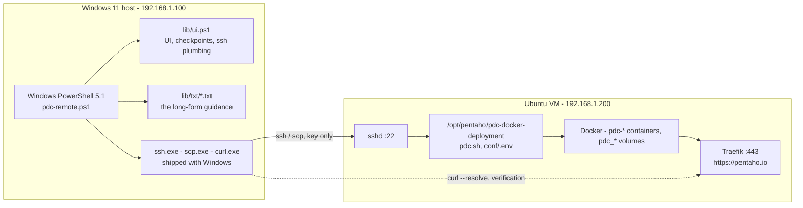

# Resetting PDC remotely from the Windows workstation

**Component:** `remote/` (pdc-remote 2.0.0)
**Applies to:** PDC 11.0.0 demo deployment, Ubuntu 24.04 VM
**Last verified:** 2026-08-06 against `192.168.1.200`

---

## 1. The problem this solves

`pdc-reset.sh` is a VM-side script. It force-removes containers, deletes
`pdc_*` volumes, `docker exec`s into the OpenSearch node to repair its
truststore, and re-runs `pdc.sh`. Every one of those needs a shell **on the
VM**.

The demo VM publishes exactly four things to the LAN:

| Port | Service | Useful for a reset? |
|------|---------|---------------------|
| 443 | PDC front door (Traefik) | No — the app API has no "wipe the stack" endpoint |
| 5433 | lab Postgres | No — separate stack |
| 9000/9001 | MinIO | No — separate stack |
| 22 | SSH | **Yes — this is the only route** |

Until 2026-08-06 port 22 was closed on this VM, so resets happened at the
console. That has now changed, and `remote/` is the remote-control layer.

> **Why not expose the Docker daemon on 2375/2376 instead?**
> Even with a remote Docker socket you would still be missing the things the
> reset actually drives: `pdc.sh` and `conf/.env`, which live on the VM's
> filesystem, and the `docker exec` cert surgery which depends on paths inside
> the container. You would also be publishing root-equivalent access to the
> LAN. SSH is both simpler and safer.

---

## 2. How it fits together



Two independent channels matter here. The script **drives** over SSH, and
**verifies** over HTTPS. That separation is deliberate: after a reset the most
common failure is a stack that looks healthy to `docker ps` but serves 404 to
every browser, so container state alone is not proof.

### No dependencies

Everything it uses ships with Windows 10/11: `ssh.exe`, `scp.exe`,
`ssh-keygen.exe`, `curl.exe`, `icacls.exe`, and PowerShell's own
`Set-Clipboard`. There is no WSL, Git Bash or make in the path. An earlier
revision was a GNU Makefile run under WSL; this replaced it so the tool has the
same footprint as the machine it runs on.

`curl.exe` rather than `Invoke-WebRequest`: PDC uses a self-signed certificate
and a vhost, and `curl --resolve` handles both in one flag without a hosts entry
and without the certificate-callback contortions 5.1 needs.

### Where the SSH key lives

`%USERPROFILE%\.ssh\id_ed25519_pdc`, with inheritance stripped and read access
granted only to the current user — Windows OpenSSH refuses a private key other
principals can read. If a key was previously enrolled from a WSL home,
`.\pdc-remote.ps1 import-wsl-key` copies it across and fixes the ACLs, so it does
not have to be enrolled on the VM a second time.

---

## 3. One-time setup

### 3.1 At the VM console — turn on sshd

Already done on this VM (2026-08-06). For reference, or for a rebuild:

```bash
whoami; id -nG
sudo apt-get update && sudo apt-get install -y openssh-server
sudo systemctl enable --now ssh
sudo ufw allow 22/tcp
```

`whoami` matters — it is the Linux account name that `.\pdc-remote.ps1 config` asks for,
and on an auto-login console it is easy to not know it. `id -nG` tells you
whether that account is already in the `docker` group.

### 3.2 On Windows — configure

```bash
cd C:\Projects\PDC-Glossary\remote
```

```bash
.\pdc-remote.ps1 config
```

Four questions; writes `remote/pdc-remote.env`, which is gitignored. No
passwords are collected.

If PowerShell blocks the script, it is unsigned and local:
`Set-ExecutionPolicy -Scope Process -ExecutionPolicy Bypass` for the session, or
`Unblock-File .\pdc-remote.ps1` once.

### 3.3 Enrol the key

`.\pdc-remote.ps1 enroll` generates an ed25519 keypair and puts a one-liner on the Windows
clipboard. Paste it at the VM console; it prints `ENROLLED`.

```
mkdir -p ~/.ssh && chmod 700 ~/.ssh && echo 'ssh-ed25519 AAAA... pdc-remote@Office' >> ~/.ssh/authorized_keys && chmod 600 ~/.ssh/authorized_keys && echo ENROLLED
```

Nothing secret crosses the gap — a public key is public. This route exists
because there is no VM password to hand to `ssh-copy-id`. If the console has no
clipboard, `.\pdc-remote.ps1 enroll-http` serves the key over HTTP from the Windows side
instead, with a short `curl` line to type at the console.

### 3.4 Prove it

```bash
.\pdc-remote.ps1 ssh-test
.\pdc-remote.ps1 doctor
```

`doctor` runs 16 checks across five groups: local tooling, configuration,
network path, authentication and remote host, and the PDC deployment itself —
including `vm.max_map_count`, free space on `/var/lib/docker`, and RAM, because
those three are what actually make OpenSearch fail on a rebuild.

---

## 4. sudo

This VM's account does **not** have passwordless sudo. That is mostly fine, and
`.\pdc-remote.ps1 sudo-help` walks through it. The short version:

`pdc-reset.sh` escalates in exactly one place — `ensure_env_kv()`, which
guarantees `LICENSING_OFFLINE_INSTALL=true` in `conf/.env`. Everything else it
does is plain `docker`, which needs **group membership**, not sudo.

And `ensure_env_kv()` short-circuits when the value is already right:

```bash
if [ -f "$f" ] && grep -q "^${key}=${val}\$" "$f"; then
  ok "conf/.env already has ${key}=${val}"
  return 0
fi
```

`conf/.env` survives the wipe. So:

| | Approach | Consequence |
|---|---|---|
| **A** *(recommended)* | Set `LICENSING_OFFLINE_INSTALL=true` once at the console (`.\pdc-remote.ps1 env-fix` prints and clipboards the exact line). | Every future reset runs with **zero** privilege escalation. Confirm with `.\pdc-remote.ps1 env-check`. |
| **B** | Install a `NOPASSWD` sudoers drop-in. | Works, but a wildcard rule for `sed -i` is close to full root. Only worth it if you want `conf/.env` managed remotely for other reasons. |
| **C** | Do nothing. | `ensure_env_kv()` warns and continues — `set -e` does not kill the run. The reset completes; you just want A done eventually. |

**The docker group is not optional**, though, and is a separate matter from
sudo. A non-interactive SSH session has nowhere to prompt for a sudo password,
so if `docker` itself needs sudo the remote reset cannot run at all:

```bash
sudo usermod -aG docker <your-user>
# then log out of the console session fully, or: newgrp docker
docker ps      # must work WITHOUT sudo
```

`.\pdc-remote.ps1 priv-test` checks this from Windows.

---

## 5. What a reset actually does

Run `.\pdc-remote.ps1 plan` for this on demand. Reproduced here for reference.

### Destroyed

Every `pdc-*` container, and every `pdc_*` volume — which means the catalog and
all profiled data sources, every glossary and business term, every Keycloak
user/role/credential in the `pdc` realm, trust scores and lineage, the installed
licence, and the css-auth-proxy email-domain allowlist.

### Survives

Everything on disk under `/opt/pentaho/pdc-docker-deployment` — `conf/`, certs,
compose files, `.env`. Also the lab data stack on 5433 and 9000: separate
containers, untouched. And this workstation's key and config.

### The script's sequence

1. `pdc.sh stop`, `docker rm -f` the `pdc-*` containers to free the volumes, `docker volume rm`
2. Enforce `LICENSING_OFFLINE_INSTALL=true` in `conf/.env`
3. `pdc.sh up`
4. Wait for the OpenSearch node's REST port
5. Append the self-signed `CN=admin` cert to `extra.crt`. A fresh `pdc_opensearch`
   volume regenerates `extra.crt` containing only the node CA, and without this
   `securityadmin` fails mTLS with `certificate_unknown` — which is what makes
   `opensearch-cluster-init` exit 1 on a clean rebuild.
6. Restart the node, then run `securityadmin` against REST 9200, up to three
   attempts — straight after a restart the node answers REST while the cluster
   is still forming, and the first attempt fails transiently.
7. **`pdc.sh up` again.** This is the step people miss. The failed init chain
   leaves `fe`, `public-api`, `glossary` and friends in `Created`; Traefik is up
   but has no backends, so every URL 404s. Re-running `up` starts them.
8. Wait for `fe` and `public-api` to report `Up`

Budget 8–20 minutes.

### What pdc-remote adds

- A snapshot of `conf/.env` plus a container, volume and disk inventory written
  to `logs/` **before** anything is touched
- Independent verification afterwards rather than trusting the exit code
- A 10-point checkpoint record so an interrupted run can be resumed
- A full transcript in `logs/`

---

## 6. The checkpoints

Each is a stamp file under `remote/.state/`. `.\pdc-remote.ps1 checkpoints` renders the
table; `.\pdc-remote.ps1 resume` reads it and tells you where to restart.

| # | Name | Passes when |
|---|------|-------------|
| 1 | `cfg` | `pdc-remote.env` written with a VM_USER |
| 2 | `ssh` | Passwordless SSH to the VM works |
| 3 | `priv` | `docker ps` works over SSH without sudo |
| 4 | `dir` | `$PDC_DIR/pdc.sh` found and executable |
| 5 | `up` | Script uploaded, CRLF-stripped, `bash -n` clean on the VM |
| 6 | `run` | `pdc-reset.sh` exited 0 |
| 7 | `os` | `.opendistro_security` index exists |
| 8 | `app` | `fe` **and** `public-api` report `Up` |
| 9 | `http` | `https://pentaho.io/` answers 200/30x — **not** 404 |
| 10 | `kc` | The Keycloak `pdc` realm's OIDC discovery doc responds |

Checkpoints 7-10 are verified by the script itself, over a different channel
from the one that drove the change. `.\pdc-remote.ps1 verify` re-runs just those.

The one that catches most real failures is **9**. A 404 there with everything
else green means services are stranded in `Created` — run `.\pdc-remote.ps1 unstick`, which
re-runs `pdc.sh up` and re-verifies. It is non-destructive.

---

## 7. Post-reset: the licence, and the JWT you need for it

The offline licence has to be re-uploaded by hand. Both routes need a bearer
token from Keycloak, because PDC's public API is OAuth2-protected.

### 7.0 A path correction worth knowing

`pdc-reset.sh` advertises `$PDC_HOST/api/public/swagger/` in its closing notes,
and posts the licence to `$PDC_HOST/api/public/v2/licensing/uploadLicense`.
**Neither prefix is routed on this build.** Probed 2026-08-06 with the stack
healthy and `public-api` reporting `Up`:

| Path | | |
|---|---|---|
| `/api/public/…` (any) | 404 | Traefik has no router for this prefix |
| `/api/…` | 302 → Keycloak | routed; oauth2-proxy wants a session |
| `/swagger/` | 302 → Keycloak | the Swagger UI |
| `/css-admin-api/api/internal/…` | 401 | routed; rejected the missing credential |

Read the codes carefully when debugging: **404 means the route does not exist**,
while 302 and 401 both mean it does and you simply are not authenticated. The
`health` command encodes exactly that distinction.

Only *routing* was verified here, not the authenticated call — confirm the exact
licensing operation in the Swagger UI once you are logged in. `SWAGGER_PATH` and
`LICENSE_PATH` in pdc-remote.ps1 (or `pdc-remote.env`) override both if this build
differs.

### 7.1 Get the token

```bash
.\pdc-remote.ps1 token
```

It prompts for the password with echo off, POSTs a direct-grant request to
`https://pentaho.io/keycloak/realms/pdc/protocol/openid-connect/token`, decodes
the JWT payload to show you the subject and expiry, saves the raw token to
`remote/.state/token.jwt` (mode 600, gitignored), and copies
`Bearer <token>` to the Windows clipboard.

The equivalent by hand:

```bash
curl -sk -X POST 'https://pentaho.io/keycloak/realms/pdc/protocol/openid-connect/token' -d client_id=pdc-client -d grant_type=password -d username=admin --data-urlencode 'password=YOURPASSWORD'
```

The response is JSON; the field you want is `access_token`.

### 7.2 Authorize in Swagger

1. Open `https://pentaho.io/swagger/` — it 302s to Keycloak, log in, and you land on the UI.
2. Click the green **Authorize** button, top right.
3. Paste:
   - If the dialog is labelled **`bearerAuth (http, Bearer)`** — paste **only
     the token**. Swagger prepends the word `Bearer` itself, and pasting it
     twice yields a 401 that looks exactly like a bad password.
   - If it shows a plain **Value** box, or says `apiKey / in: header` — paste
     the whole `Bearer eyJ...` string.

   `.\pdc-remote.ps1 token` puts the `Bearer …` form on the clipboard; the bare token is in
   `.state/token.jwt` if you need the shorter one.
4. **Authorize**, then **Close**. Endpoints now show a closed padlock.

### 7.3 Upload

Find the licensing upload operation → **Try it out**

- `deviceId` = `pdc-demo`
- `fileData` = your `.bin`, via **Choose File**

**Execute.** A 200 with licence details means it took. Confirm in the PDC UI
under **Administration → Licensing**.

### 7.4 Token troubleshooting

| Response | Meaning |
|---|---|
| `invalid_grant` | Wrong username or password. PDC wants the **username** (`admin`, `catalog.admin`) — *not* the email address. |
| `unauthorized_client` | The client does not allow direct-access-grants. Enable it in the Keycloak admin console, or use the browser flow and copy the token out of devtools. |
| `invalid_client` | Wrong client id for this build. List the realm's clients in the Keycloak admin console. |
| 404 on any PDC path | That prefix is not routed by Traefik at all — see the path note in §7.0. Distinct from a 302 (route exists, needs auth) or 401 (route exists, rejected the credential). |
| 404 on the realm URL | Keycloak is not up, or the realm import has not finished. Check with `.\pdc-remote.ps1 health`. |
| 401 from Swagger after it worked | The token expired — they last 5–15 minutes. Re-run `.\pdc-remote.ps1 token` and re-Authorize. |

### 7.5 Skipping Swagger entirely

If the `.bin` is already on the VM, set `LICENSE_BIN` in `pdc-remote.env` and
run `.\pdc-remote.ps1 license`. Otherwise, from Windows:

```bash
curl -k -X POST 'https://pentaho.io/api/v2/licensing/uploadLicense' -H "Authorization: Bearer $(cat remote/.state/token.jwt)" -F 'deviceId=pdc-demo' -F 'fileData=@/path/to/licence.bin;type=application/octet-stream'
```

---

## 8. The other manual steps after a reset

1. Log in at `https://pentaho.io` as **`admin`** — the *username*, not an email.
   11.0.0 seeds the `pdc` realm with stock users. If the password is unknown,
   set it with `kcadm` from the VM console — see
   [PDC-VM-TROUBLESHOOTING.md](PDC-VM-TROUBLESHOOTING.md), the `invalid_grant`
   section.
2. Re-upload the offline licence (§7).
3. Reload the lab data and re-register the data sources. The lab stack on
   5433/9000 was *not* touched, but the catalog's record of it was.
4. Reload the cast into Keycloak, then re-add any custom email domains to the
   css-auth-proxy allowlist. PDC rejects logins whose email domain is not on
   that list, and the list lived in a volume that has just been deleted.

---

## 9. Command reference

Run `.\pdc-remote.ps1 help` for the same list in the terminal.

### Setup

| Command | Does |
|---|---|
| `config` | Interactive; writes `pdc-remote.env` |
| `show-config` | Effective settings, with presence checks on each path |
| `probe` | Port scan of 22/443/5433/9000/9001/2376 |
| `enable-ssh` | Prints the VM-console commands to turn sshd on |
| `wait-ssh` | Polls port 22 for up to 5 minutes |
| `keygen` | Creates `~/.ssh/id_ed25519_pdc` if absent |
| `enroll` | keygen + puts the `authorized_keys` one-liner on the clipboard |
| `enroll-http` | Fallback: serve the public key over HTTP from Windows |
| `ssh-test` | Smoke-test the login; maps common errors to fixes |
| `priv-test` | Checks docker-without-sudo and passwordless sudo |
| `doctor` | The full 16-check preflight |
| `sudo-help` | The three sudo strategies |
| `env-check` / `env-fix` | Inspect / fix `LICENSING_OFFLINE_INSTALL` |

### Operations

| Command | Does |
|---|---|
| `status` (`ps`) | `pdc.sh ps` plus a tally of container states |
| `health` | HTTP probe of front door, swagger, Keycloak realm, css-admin-api |
| `logs SVC=fe N=200` | Tail one service's container logs |
| `unstick` | Re-run `pdc.sh up`, then re-verify. Non-destructive. |
| `shell` | Interactive SSH |

### Reset

| Command | Does |
|---|---|
| `plan` | Full description of what a reset would do. Changes nothing. |
| `dry-run` | Asks the VM which containers/volumes *would* go, and how much disk that frees |
| `backup` | Snapshot `conf/.env` + inventories into `logs/` |
| `upload` | CRLF-strip, scp, chmod, `bash -n` on the VM |
| `reset` | The full 10-checkpoint run |
| `reset-keep-opensearch` | Same with `--keep-opensearch` — preserves the OpenSearch volumes and skips the securityadmin repair. Much faster. |
| `resume` | Reads the checkpoints and names the next step |
| `verify` | Re-run checkpoints 7–10 only |

### After

| Command | Does |
|---|---|
| `token` | Fetch a JWT, decode it, clipboard it, explain Swagger |
| `license` | Upload a `.bin` that already sits on the VM |

### State

`checkpoints`, `clean`, `clean-logs`, `distclean`, `version`.

---

## 10. Troubleshooting

| Symptom | Cause | Fix |
|---|---|---|
| `make` anything → `Permission denied (publickey)` | Key not in `authorized_keys` | `.\pdc-remote.ps1 enroll`, paste at the console |
| `Connection refused` on 22 | sshd not running | `.\pdc-remote.ps1 enable-ssh` at the console |
| `doctor`: "docker needs sudo" | Account not in the `docker` group | `sudo usermod -aG docker <user>`, then log out fully |
| Everything green but the site 404s | Services stranded in `Created` | `.\pdc-remote.ps1 unstick` |
| `os` checkpoint fails | `securityadmin` never wrote `.opendistro_security` | `.\pdc-remote.ps1 logs SVC=opensearch`; check `vm.max_map_count`, disk watermark, RAM — `doctor` reports all three |
| `kc` checkpoint fails right after a reset | Realm import still running | Wait, then `.\pdc-remote.ps1 verify` |
| Swagger 401 after it worked | Token expired | `.\pdc-remote.ps1 token` again |
| `bash: /tmp/pdc-reset.sh: cannot execute` | CRLF line endings | `.\pdc-remote.ps1 upload` already strips them; check you did not scp it by hand |
| `reset` aborts at the confirm step | You typed something other than `reset` | Intentional. Re-run. |

---

## 11. Files

```
remote\
  pdc-remote.ps1           the driver, 36 commands
  pdc-remote.env.example   copy to pdc-remote.env, or run: config
  pdc-remote.env           your config          (gitignored)
  lib\
    ui.ps1                 UI, checkpoints, prompts, logging, render, ssh/scp
    txt\*.txt              the long-form guidance printed by the commands
  .state\                  checkpoint stamps, token.jwt, enroll command  (gitignored)
  logs\                    timestamped transcripts and backups           (gitignored)
```

### Four things to know before you edit it

**ASCII only.** Em-dashes and smart quotes break PowerShell 5.1 parsing.

**5.1, not 7.** No `&&`/`||` chain operators, no ternary, no `??`, no `?.`.
Use `if`/`else` and explicit `$null -eq` checks.

**Remote commands are base64-wrapped.** 5.1 does not escape embedded double
quotes when handing arguments to a native exe, so any remote command containing
quotes, pipes or `||` arrives at bash mangled — `syntax error near unexpected
token`. `Get-RemotePayload` encodes it to `[A-Za-z0-9+/=]` and pipes it through
`base64 -d | bash` on the VM. Build remote commands as plain strings and let
that helper deal with it. Related trap: build a remote `--format` string with
`\t`, not a PowerShell backtick-`t` — inside a single-quoted string the backtick
is literal and bash reads `` `t...` `` as a command substitution.

**Never redirect a native exe's stderr with `2>&1` on the PowerShell side.**
5.1 wraps each line in an ErrorRecord and reports failure even on exit 0, which
with `$ErrorActionPreference = 'Stop'` aborts the run. Merge on the Linux side
instead — `Invoke-Remote -Merge` appends the redirect to the remote `bash`.
Same reason `Get-SshVersion` reads the binary's version resource rather than
running `ssh -V`, which writes its banner to stderr.

Long prose lives in `lib\txt\` and is printed via
`Invoke-Render <name> @{KEY = 'value'}`, substituting `@KEY@` placeholders, so
the text reaches the console exactly as written.

---

## 12. Security notes

- **No password ever passes through this tool to disk.** SSH is key-only. The
  PDC admin password is read with `Read-Host -AsSecureString`, converted only
  for the single request that needs it, and dropped immediately after.
- **The JWT is a credential.** `.state\token.jwt` has its ACLs stripped to the current user, and is gitignored.
  It expires in minutes, but treat it like a password until it does.
- `pdc-remote.env`, `.state\` and `logs\` are all gitignored. `logs\` contains
  a copy of `conf/.env` after a `backup` — do not commit it.
- The key is dedicated (`id_ed25519_pdc`) and passphrase-less, which is
  appropriate for a lab VM on a private LAN and would not be for anything else.
  To revoke: delete the line from `~/.ssh/authorized_keys` on the VM.
- `.\pdc-remote.ps1 reset` requires typing the word `reset`. There is no `--force`.
