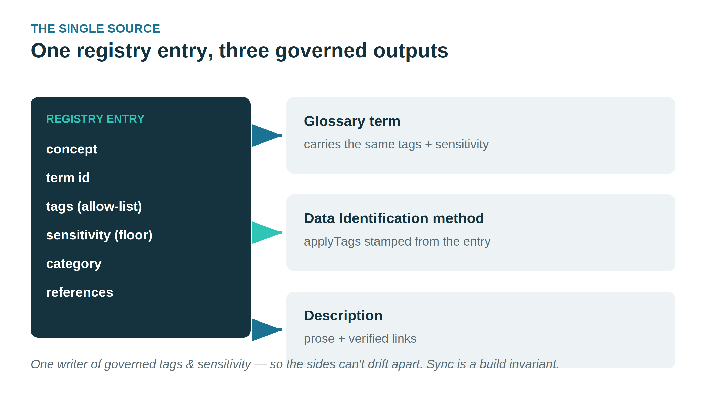
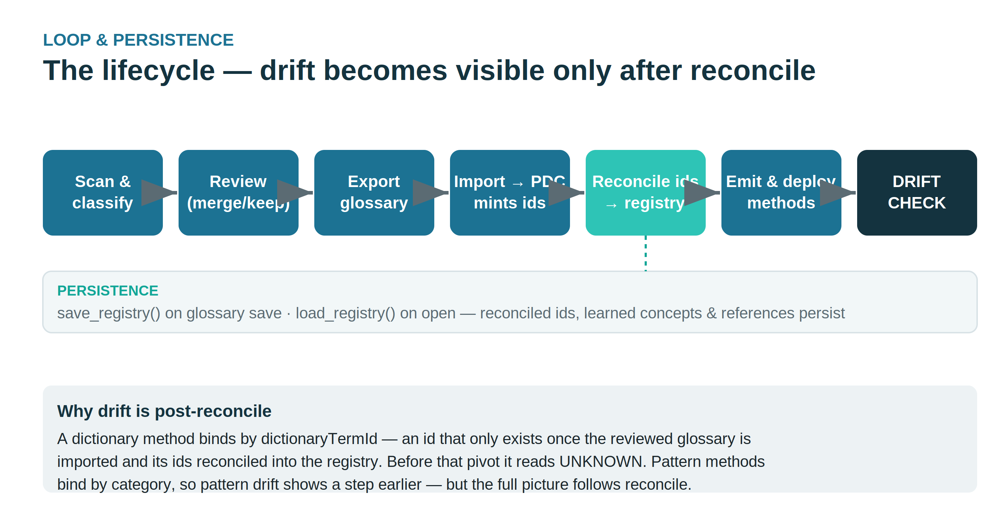
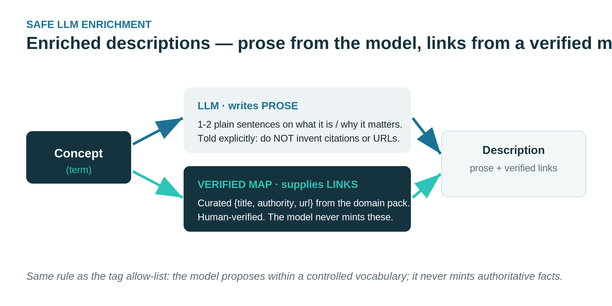
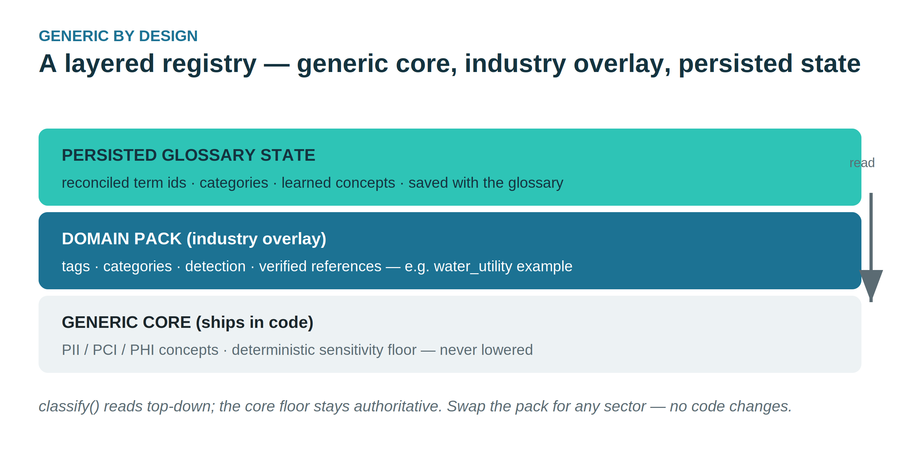

# Supplement: Build the Glossary with the Generator App

**Primary role:** Data Steward / Solution Architect
**Estimated time:** 60 min
**Track:** Technical / app-driven — an *alternative* to the manual glossary in Workshop 3
**App version:** 1.7.1 · validated against **PDC 10.2.11**

## What this is

The **Glossary Generator** is a companion app that builds and applies a business
glossary over the PDC public API instead of by hand in the Data Canvas. It is the
app-driven counterpart to **Workshop 3: Build the Business Glossary** — same
deliverable (a governed, linked glossary), different method.

The app is **scenario-generic**: it carries no built-in vocabulary and is tailored to
a client through a *domain pack* plus a company name. For the **Copper State Credit
Union (CSCU)** scenario it is configured with the credit-union pack — unzip
`data_sources/CSCU/cscu-domain-pack.zip` into `glossary_generator/` and set
`GLOSSARY_COMPANY="Copper State Credit Union"` — which installs CSCU's curated terms
(Member Record, Loan Record, KYC Review Record, …). Point it at a different client by
swapping the pack — no code changes. (The Arizona Water Company scenario ships
separately under `data_sources/AWC/`.)

## What's new in 1.5.7

- **Per-group resolution, inline in the grid.** Each duplicate name gets a header row in
  the Review table with a three-way **Merge / Disambiguate / Keep separate** control and
  its candidates clustered beneath — **merge one name and disambiguate another in the same
  pass**. The selected option is highlighted and reverts on a second click.
- **Duplicate detection is dynamic** — it recomputes from the current names over kept
  rows, so the groups update live as you rename inline, cull with *Keep High+Med conf*, or
  apply suggested names.
- **Reversible review controls + Reset all.** *Keep High+Med conf*, *Merge duplicates* and
  *Auto-disambiguate* highlight when applied and revert on a second click; **Reset all**
  returns the grid to the raw scan.
- **Table terms are protected.** A table term is never grouped, merged, culled, or
  deleted — even if it shares a name with a real duplicate group.
- **Resolutions survive a later LLM enrich**, so it's safe to apply the LLM after merging
  or disambiguating.

### From 1.5.6
- **Table terms are kept by default** and are never dropped by the confidence cull, even
  at LOW confidence. *Keep High+Med conf* skips table-level terms (e.g. *Customer
  Record*); only an explicit steward action removes one.
- **Fixed** a `/api/enrich` 500 on null rows.
- **Bundled scenario pack** gives every table term a `Record` suffix (*Member Record*,
  *Loan Record*, …).

See **`CHANGELOG.md`** for the full list and the developer patch summary.

## What's in this package

> The authoritative contents list for this 1.6.20 asset set is **`MANIFEST.md`**.

- **`registry/`** — the app-side **Registry writer** (Python package, v1.6.20): maps the
  final reviewed rows to `registries/registry.<glossary>.json` at export
  (`POST /api/generate`), with an offline 11-check self-test. The classify / emit / drift /
  reconcile engine ships separately as the standalone **Policy Generator** (`policy_generator/`).
- **`courseware/CSCU/Workshop-Glossary-Generator-CSCU.md`** — the CSCU workshop guide
  (the AWC deck and Word doc are preserved under `courseware/AWC/`).
- **`CHALLENGE-AND-GOAL.md`** — one-page steward / analyst explainer.
- **`glossary_generator/diagrams/`** — the architecture figures (PNG + editable SVG).
- **`data_sources/CSCU/domain_pack/credit_union.people.json`** — the CSCU people/steward
  roster seed (owners of glossary terms), installed by the pack zip.
- **`data_sources/CSCU/cscu-datasources.csv`** — the two CSCU lab connections
  (PostgreSQL + MinIO), pre-filled for the bulk connection loader (`/api/pdc/bulk-load`).
- **`INSTALL.md`** — install the Flask Glossary Generator app against your own PDC instance.
- **`CHANGELOG.md`** — release notes; **1.6.20** is the current version.

This package **is** the Flask Glossary Generator app (VERSION `1.6.20`) — the app that
`INSTALL.md` stands up. The **Policy Generator** ships as a **separate download**
(`policy_generator/`, its own zip): the standalone engine that reads the Registry and
emits/drift-checks the Data Identification policy.

## Install it on your own PDC instance

If the app isn't already pre-installed on your lab VM — or you're standing it up
against a live PDC instance — follow **`INSTALL.md`**. In short: run it with
Docker (`docker compose up --build`) or locally (`./run.sh`), install the CSCU pack
zip and set `GLOSSARY_COMPANY`, smoke-test `GET /health`, then
in the UI open **Glossary → Data Elements**, enter your PDC base URL + version, and
**Get token**. The app keeps the token in memory only and needs an admin or Business
Steward account. Treat the **Apply** dry-run as mandatory the first time you point it
at a new instance.

## Why it runs after Data Identification, not at the Workshop 3 manual-glossary slot

The manual glossary (Workshop 3) authors tags and sensitivity *by hand*, so it has no
data-scan prerequisite. The app is different: it **rides on PDC's data scan** — it
confirms and overrides the dictionary/pattern tags and sensitivity that **Data
Identification** produces. That means the PDC processing chain has to be complete first:

```
1  Connect            (Workshop 1)
2  Metadata Ingest    (Workshop 2 — structure & metadata)
3  Data Profiling     (statistics, keys, data-quality pre-analysis)
4  Data Identification + PII   (dictionary/pattern tags + auto-sensitivity)
5  Glossary Generator App  ← this step: steward confirms/overrides, links terms,
                             sets CDE / verified lineage / rating, Calculate Trust Score
```

Running Identification first also satisfies PDC's **Required** gate (Identification
cannot run on an unprofiled table), so the app starts from a complete, confidence-scored
baseline and the steward curates it.

## Lifecycle — read before you run it

- **PDC sets the baseline, the steward overrides.** Let Data Identification apply its
  dictionary/pattern tags and sensitivity once; the app is how the steward corrects them.
- **Identify *once*.** Re-running Data Identification after the app re-fires its
  dictionary/pattern actions and clobbers the steward's overrides. Treat Identification
  as a one-time baseline before this workshop, then don't re-run it.
- **Review is subtractive, per-term, and reversible.** Every column arrives as a candidate
  term, so you prune rather than hunt. Duplicate names cluster under an inline header with
  a **Merge / Disambiguate / Keep separate** control (detection is live as you edit/cull);
  *Keep High+Med conf* / *Merge duplicates* / *Auto-disambiguate* highlight when applied
  and revert on a second click; **Reset all** returns to the raw scan. Table terms are
  never grouped, merged, or deleted.
- **Table terms are kept by default.** A table-level term (e.g. *Customer Record*) is the
  fourth Trust Score input, so the confidence cull never drops it — only an explicit
  steward action does. Filter by confidence to triage columns, not to remove table terms.
- **Tags vs sensitivity behave differently on write.** Sensitivity is a scalar — the
  app's PATCH overwrites it cleanly. Tags are an **array that PDC full-replaces** when
  sent, so any tag override must **read the current tags, merge, then write** the whole
  set — otherwise it wipes the auto-tags Identification just applied.
- **Trust Score last.** It rolls up Data Quality + Ratings + Lineage + Classification +
  whether a glossary term is assigned, so calculate it after every other input is final.

## What's new in 1.6.1

- **The registry persists with the glossary.** Save writes the working registry
  (reconciled term ids, categories, learned concepts, tags, sensitivity,
  references) to `registry.<glossary>.json`; open reloads it. The reconcile
  handshake — and therefore drift detection — now survives a restart.
- **Verified compliance references.** Domain packs carry a curated, human-verified
  reference map — add your sector's regulator links (e.g. NCUA, FinCEN for CSCU;
  the AWC water pack shipped real EPA and Arizona ADEQ links).
- **Safe description enrichment.** The LLM writes the prose; the links come only
  from the verified map — the model never mints a regulation or URL.

### Architecture at a glance









## The Registry & drift reconcile (1.6.0)

1.6.0 adds a **single Registry** that unifies the three things the
steward used to set by hand and in different places — the **business term**, the
governed **tags**, and the **sensitivity**. One canonical entry per *concept*
carries all three (plus a category for pattern methods), and **both** the
glossary term and the Data Identification method are generated from that one
entry. Because they share a source, the glossary tag and the method tag cannot
drift apart by construction.

Two capabilities sit on top of the registry:

- **Policy Generator** (formerly Method Advisor -> Metadata Advisor -> Classification Registry) emits Data Identification
  **DataPattern** and **Dictionary** methods that bind back to the glossary
  (dictionary → `dictionaryTermId`, pattern → `categories`) and stamp their tags
  from the registry.
- **Drift linter + reconcile** read a deployed method back and diff its tags
  against the registry, reporting **OK / DRIFT / UNLINKED / ORPHAN** per method
  and **CLASSIFIED / UNKNOWN / MISSING / DRIFT / UNLINKED** per concept.

### Why drift can only be seen *after* reconciliation

This is the ordering that matters. A dictionary method binds to a concept by its
`dictionaryTermId` — a real glossary term id that **does not exist until the
reviewed glossary is imported into PDC and its minted ids are read back into the
app**. So the loop is:

```
scan & classify  ->  review (merge/disambiguate/keep)  ->  export glossary
      ->  import into PDC (PDC mints term ids)  ->  reconcile ids back into the
      registry  ->  emit methods bound to those ids  ->  deploy  ->  DRIFT CHECK
```

Until the reconcile step writes the minted ids into the registry, dictionary
methods read as **UNKNOWN** and their tag drift cannot be assessed — there is no
id to match them to a concept. (Pattern methods bind by *category* name, so
pattern drift can be seen a step earlier, but the complete drift picture is a
post-reconciliation view.) In short: **review the term, round-trip it through
PDC, reconcile the id, *then* drift becomes visible.**

### Generic — configured per industry, not baked in

The core registry is industry-neutral (PII / PCI / PHI). Industry vocabulary is
**not** hard-coded — it loads from a domain pack, exactly like the glossary
engine's `GLOSSARY_DOMAIN_PACK`. Set `CLASSIFICATION_DOMAIN_PACK` to a pack JSON
(concepts + tags + categories + detection rules). Example packs ship for the
credit-union and water-utility scenarios as **illustrations**; copy one and swap the
vocabulary for healthcare, retail, or any sector without touching code.

## Not a replacement for BA Workshop 5

This is a separate technical/Solution-Architect session. It does **not** replace
**Workshop 5: Protect Sensitive Data** in the 11-workshop Business-Analyst path — it is
the app-driven alternative to the manual glossary. Use one glossary method per source
(manual *or* app), not both.

All data is fictional and generated for training.
